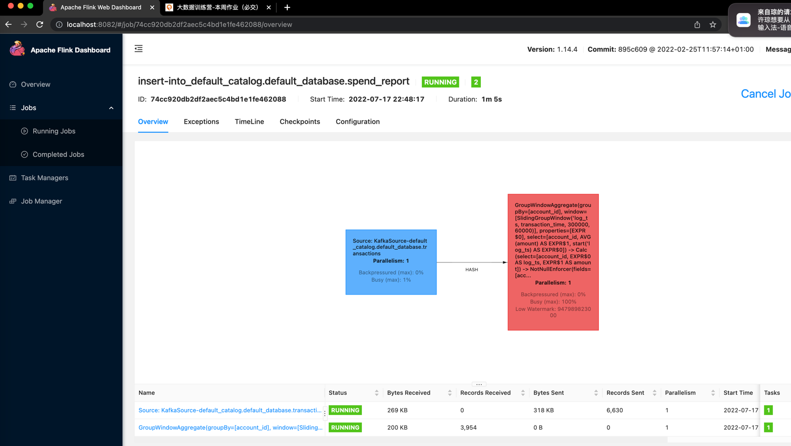
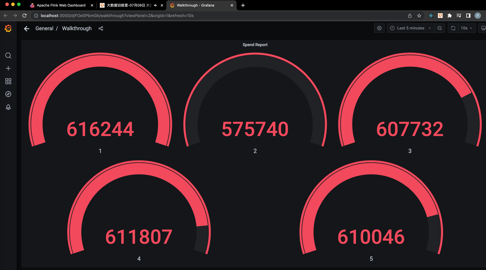

# 第十四周作业

## 代码
```java
    public static Table report(Table transactions) {
    //Slide 滑动窗口, 大小为5分钟, 每一分种滑动一次，滑动时间为transaction_time
        Table table = transactions.window(Slide
            .over(lit(5).minutes())
            .every(lit(1).minutes())
            .on($("transaction_time")).as("log_ts"))
        .groupBy($("account_id"), $("log_ts"))
        .select($("account_id"),
            $("log_ts").start().as("log_ts"),
            $("amount").avg().as("amount"));
        return table;
    }
```

1. flinkui

2. jobmanager log
```
2022-07-17 14:49:57,823 INFO  org.apache.flink.runtime.source.coordinator.SourceCoordinator [] - Marking checkpoint 3 as completed for source Source: KafkaSource-default_catalog.default_database.transactions.
2022-07-17 14:49:57,824 INFO  org.apache.flink.runtime.checkpoint.CheckpointCoordinator    [] - Triggering checkpoint 4 (type=CHECKPOINT) @ 1658069397823 for job 74cc920db2df2aec5c4bd1e1fe462088.
2022-07-17 14:50:46,021 INFO  org.apache.flink.runtime.checkpoint.CheckpointCoordinator    [] - Completed checkpoint 4 for job 74cc920db2df2aec5c4bd1e1fe462088 (11721 bytes, checkpointDuration=48198 ms, finalizationTime=0 ms).
2022-07-17 14:50:46,024 INFO  org.apache.flink.runtime.source.coordinator.SourceCoordinator [] - Marking checkpoint 4 as completed for source Source: KafkaSource-default_catalog.default_database.transactions.
2022-07-17 14:50:46,024 INFO  org.apache.flink.runtime.checkpoint.CheckpointCoordinator    [] - Triggering checkpoint 5 (type=CHECKPOINT) @ 1658069446022 for job 74cc920db2df2aec5c4bd1e1fe462088.
2022-07-17 14:51:39,958 INFO  org.apache.flink.runtime.checkpoint.CheckpointCoordinator    [] - Completed checkpoint 5 for job 74cc920db2df2aec5c4bd1e1fe462088 (10017 bytes, checkpointDuration=53936 ms, finalizationTime=0 ms).
2022-07-17 14:51:39,959 INFO  org.apache.flink.runtime.source.coordinator.SourceCoordinator [] - Marking checkpoint 5 as completed for source Source: KafkaSource-default_catalog.default_database.transactions.
2022-07-17 14:51:39,959 INFO  org.apache.flink.runtime.checkpoint.CheckpointCoordinator    [] - Triggering checkpoint 6 (type=CHECKPOINT) @ 1658069499959 for job 74cc920db2df2aec5c4bd1e1fe462088.
2022-07-17 14:52:40,020 INFO  org.apache.flink.runtime.checkpoint.CheckpointCoordinator    [] - Completed checkpoint 6 for job 74cc920db2df2aec5c4bd1e1fe462088 (8313 bytes, checkpointDuration=60061 ms, finalizationTime=0 ms).
2022-07-17 14:52:40,021 INFO  org.apache.flink.runtime.source.coordinator.SourceCoordinator [] - Marking checkpoint 6 as completed for source Source: KafkaSource-default_catalog.default_database.transactions.
2022-07-17 14:52:40,021 INFO  org.apache.flink.runtime.checkpoint.CheckpointCoordinator    [] - Triggering checkpoint 7 (type=CHECKPOINT) @ 1658069560021 for job 74cc920db2df2aec5c4bd1e1fe462088.
2022-07-17 14:53:36,931 INFO  org.apache.flink.runtime.checkpoint.CheckpointCoordinator    [] - Completed checkpoint 7 for job 74cc920db2df2aec5c4bd1e1fe462088 (195185 bytes, checkpointDuration=56910 ms, finalizationTime=0 ms).
2022-07-17 14:53:36,932 INFO  org.apache.flink.runtime.source.coordinator.SourceCoordinator [] - Marking checkpoint 7 as completed for source Source: KafkaSource-default_catalog.default_database.transactions.
2022-07-17 14:53:36,933 INFO  org.apache.flink.runtime.checkpoint.CheckpointCoordinator    [] - Triggering checkpoint 8 (type=CHECKPOINT) @ 1658069616932 for job 74cc920db2df2aec5c4bd1e1fe462088.
2022-07-17 14:54:57,200 INFO  org.apache.flink.runtime.checkpoint.CheckpointCoordinator    [] - Completed checkpoint 8 for job 74cc920db2df2aec5c4bd1e1fe462088 (6609 bytes, checkpointDuration=80267 ms, finalizationTime=1 ms).
2022-07-17 14:54:57,202 INFO  org.apache.flink.runtime.source.coordinator.SourceCoordinator [] - Marking checkpoint 8 as completed for source Source: KafkaSource-default_catalog.default_database.transactions.
2022-07-17 14:54:57,202 INFO  org.apache.flink.runtime.checkpoint.CheckpointCoordinator    [] - Triggering checkpoint 9 (type=CHECKPOINT) @ 1658069697202 for job 74cc920db2df2aec5c4bd1e1fe462088.
2022-07-17 14:56:12,358 INFO  org.apache.flink.runtime.checkpoint.CheckpointCoordinator    [] - Completed checkpoint 9 for job 74cc920db2df2aec5c4bd1e1fe462088 (6609 bytes, checkpointDuration=75155 ms, finalizationTime=0 ms).
2022-07-17 14:56:12,359 INFO  org.apache.flink.runtime.source.coordinator.SourceCoordinator [] - Marking checkpoint 9 as completed for source Source: KafkaSource-default_catalog.default_database.transactions.
2022-07-17 14:56:12,359 INFO  org.apache.flink.runtime.checkpoint.CheckpointCoordinator    [] - Triggering checkpoint 10 (type=CHECKPOINT) @ 1658069772358 for job 74cc920db2df2aec5c4bd1e1fe462088.
2022-07-17 14:57:26,550 INFO  org.apache.flink.runtime.checkpoint.CheckpointCoordinator    [] - Completed checkpoint 10 for job 74cc920db2df2aec5c4bd1e1fe462088 (196605 bytes, checkpointDuration=74192 ms, finalizationTime=0 ms).
2022-07-17 14:57:26,551 INFO  org.apache.flink.runtime.source.coordinator.SourceCoordinator [] - Marking checkpoint 10 as completed for source Source: KafkaSource-default_catalog.default_database.transactions.
2022-07-17 14:57:26,552 INFO  org.apache.flink.runtime.checkpoint.CheckpointCoordinator    [] - Triggering checkpoint 11 (type=CHECKPOINT) @ 1658069846551 for job 74cc920db2df2aec5c4bd1e1fe462088.
2022-07-17 14:58:26,355 INFO  org.apache.flink.runtime.checkpoint.CheckpointCoordinator    [] - Completed checkpoint 11 for job 74cc920db2df2aec5c4bd1e1fe462088 (386317 bytes, checkpointDuration=59803 ms, finalizationTime=1 ms).
2022-07-17 14:58:26,356 INFO  org.apache.flink.runtime.source.coordinator.SourceCoordinator [] - Marking checkpoint 11 as completed for source Source: KafkaSource-default_catalog.default_database.transactions.
2022-07-17 14:58:26,357 INFO  org.apache.flink.runtime.checkpoint.CheckpointCoordinator    [] - Triggering checkpoint 12 (type=CHECKPOINT) @ 1658069906356 for job 74cc920db2df2aec5c4bd1e1fe462088.
2022-07-17 14:59:51,203 INFO  org.apache.flink.runtime.checkpoint.CheckpointCoordinator    [] - Completed checkpoint 12 for job 74cc920db2df2aec5c4bd1e1fe462088 (6609 bytes, checkpointDuration=84846 ms, finalizationTime=1 ms).
2022-07-17 14:59:51,204 INFO  org.apache.flink.runtime.source.coordinator.SourceCoordinator [] - Marking checkpoint 12 as completed for source Source: KafkaSource-default_catalog.default_database.transactions.
2022-07-17 14:59:51,204 INFO  org.apache.flink.runtime.checkpoint.CheckpointCoordinator    [] - Triggering checkpoint 13 (type=CHECKPOINT) @ 1658069991203 for job 74cc920db2df2aec5c4bd1e1fe462088.
2022-07-17 15:01:04,377 INFO  org.apache.flink.runtime.checkpoint.CheckpointCoordinator    [] - Completed checkpoint 13 for job 74cc920db2df2aec5c4bd1e1fe462088 (196605 bytes, checkpointDuration=73174 ms, finalizationTime=0 ms).
2022-07-17 15:01:04,379 INFO  org.apache.flink.runtime.source.coordinator.SourceCoordinator [] - Marking checkpoint 13 as completed for source Source: KafkaSource-default_catalog.default_database.transactions.
2022-07-17 15:01:04,380 INFO  org.apache.flink.runtime.checkpoint.CheckpointCoordinator    [] - Triggering checkpoint 14 (type=CHECKPOINT) @ 1658070064379 for job 74cc920db2df2aec5c4bd1e1fe462088.
2022-07-17 15:02:12,707 WARN  akka.remote.ReliableDeliverySupervisor                       [] - Association with remote system [akka.tcp://flink@172.19.0.8:33487] has failed, address is now gated for [50] ms. Reason: [Disassociated]
2022-07-17 15:02:12,710 WARN  akka.remote.ReliableDeliverySupervisor                       [] - Association with remote system [akka.tcp://flink-metrics@172.19.0.8:37369] has failed, address is now gated for [50] ms. Reason: [Disassociated]
2022-07-17 15:02:12,861 INFO  org.apache.flink.runtime.entrypoint.ClusterEntrypoint        [] - RECEIVED SIGNAL 15: SIGTERM. Shutting down as requested.
2022-07-17 15:02:12,868 INFO  org.apache.flink.runtime.entrypoint.ClusterEntrypoint        [] - Shutting StandaloneApplicationClusterEntryPoint down with application status UNKNOWN. Diagnostics Cluster entrypoint has been closed externally..
2022-07-17 15:02:13,072 INFO  akka.remote.RemoteActorRefProvider$RemotingTerminator        [] - Shutting down remote daemon.
2022-07-17 15:02:13,076 INFO  akka.remote.RemoteActorRefProvider$RemotingTerminator        [] - Remote daemon shut down; proceeding with flushing remote transports.
2022-07-17 15:02:13,089 INFO  akka.remote.RemoteActorRefProvider$RemotingTerminator        [] - Shutting down remote daemon.
2022-07-17 15:02:13,092 INFO  akka.remote.RemoteActorRefProvider$RemotingTerminator        [] - Remote daemon shut down; proceeding with flushing remote transports.
2022-07-17 15:02:13,131 INFO  akka.remote.RemoteActorRefProvider$RemotingTerminator        [] - Remoting shut down.
```
3. taskmanager log
```
2022-07-17 14:48:18,068 INFO  org.apache.flink.runtime.taskmanager.Task                    [] - GroupWindowAggregate(groupBy=[account_id], window=[SlidingGroupWindow('log_ts, transaction_time, 300000, 60000)], properties=[EXPR$0], select=[account_id, AVG(amount) AS EXPR$1, start('log_ts) AS EXPR$0]) -> Calc(select=[account_id, EXPR$0 AS log_ts, EXPR$1 AS amount]) -> NotNullEnforcer(fields=[account_id, log_ts]) -> Sink: Sink(table=[default_catalog.default_database.spend_report], fields=[account_id, log_ts, amount]) (1/1)#0 (4a79dc7028d78a8a4e7469c3ae328776) switched from CREATED to DEPLOYING.
2022-07-17 14:48:18,069 INFO  org.apache.flink.runtime.taskexecutor.slot.TaskSlotTableImpl [] - Activate slot f258029311b110fdae257f2ccfd68e2c.
2022-07-17 14:48:18,083 INFO  org.apache.flink.runtime.taskmanager.Task                    [] - Loading JAR files for task GroupWindowAggregate(groupBy=[account_id], window=[SlidingGroupWindow('log_ts, transaction_time, 300000, 60000)], properties=[EXPR$0], select=[account_id, AVG(amount) AS EXPR$1, start('log_ts) AS EXPR$0]) -> Calc(select=[account_id, EXPR$0 AS log_ts, EXPR$1 AS amount]) -> NotNullEnforcer(fields=[account_id, log_ts]) -> Sink: Sink(table=[default_catalog.default_database.spend_report], fields=[account_id, log_ts, amount]) (1/1)#0 (4a79dc7028d78a8a4e7469c3ae328776) [DEPLOYING].
2022-07-17 14:48:18,163 INFO  org.apache.flink.streaming.runtime.tasks.StreamTask          [] - No state backend has been configured, using default (HashMap) org.apache.flink.runtime.state.hashmap.HashMapStateBackend@709214d3
2022-07-17 14:48:18,163 INFO  org.apache.flink.runtime.state.StateBackendLoader            [] - State backend loader loads the state backend as HashMapStateBackend
2022-07-17 14:48:18,165 INFO  org.apache.flink.streaming.runtime.tasks.StreamTask          [] - Checkpoint storage is set to 'jobmanager'
2022-07-17 14:48:18,191 INFO  org.apache.flink.runtime.taskmanager.Task                    [] - GroupWindowAggregate(groupBy=[account_id], window=[SlidingGroupWindow('log_ts, transaction_time, 300000, 60000)], properties=[EXPR$0], select=[account_id, AVG(amount) AS EXPR$1, start('log_ts) AS EXPR$0]) -> Calc(select=[account_id, EXPR$0 AS log_ts, EXPR$1 AS amount]) -> NotNullEnforcer(fields=[account_id, log_ts]) -> Sink: Sink(table=[default_catalog.default_database.spend_report], fields=[account_id, log_ts, amount]) (1/1)#0 (4a79dc7028d78a8a4e7469c3ae328776) switched from DEPLOYING to INITIALIZING.
2022-07-17 14:48:18,255 INFO  org.apache.flink.streaming.runtime.tasks.StreamTask          [] - No state backend has been configured, using default (HashMap) org.apache.flink.runtime.state.hashmap.HashMapStateBackend@12b9196a
2022-07-17 14:48:18,257 INFO  org.apache.flink.runtime.state.StateBackendLoader            [] - State backend loader loads the state backend as HashMapStateBackend
2022-07-17 14:48:18,257 INFO  org.apache.flink.streaming.runtime.tasks.StreamTask          [] - Checkpoint storage is set to 'jobmanager'
2022-07-17 14:48:18,258 INFO  org.apache.flink.runtime.taskmanager.Task                    [] - Source: KafkaSource-default_catalog.default_database.transactions (1/1)#0 (bf6b7726a6cf147098b1ff6c47a20f99) switched from DEPLOYING to INITIALIZING.
2022-07-17 14:48:18,325 WARN  org.apache.flink.metrics.MetricGroup                         [] - The operator name Sink: Sink(table=[default_catalog.default_database.spend_report], fields=[account_id, log_ts, amount]) exceeded the 80 characters length limit and was truncated.
2022-07-17 14:48:18,673 WARN  org.apache.flink.metrics.MetricGroup                         [] - The operator name GroupWindowAggregate(groupBy=[account_id], window=[SlidingGroupWindow('log_ts, transaction_time, 300000, 60000)], properties=[EXPR$0], select=[account_id, AVG(amount) AS EXPR$1, start('log_ts) AS EXPR$0]) exceeded the 80 characters length limit and was truncated.
Loading class `com.mysql.jdbc.Driver'. This is deprecated. The new driver class is `com.mysql.cj.jdbc.Driver'. The driver is automatically registered via the SPI and manual loading of the driver class is generally unnecessary.
2022-07-17 14:48:19,038 WARN  org.apache.flink.connector.kafka.source.reader.KafkaSourceReader [] - Offset commit on checkpoint is disabled. Consuming offset will not be reported back to Kafka cluster.
2022-07-17 14:48:19,078 INFO  org.apache.flink.runtime.taskmanager.Task                    [] - Source: KafkaSource-default_catalog.default_database.transactions (1/1)#0 (bf6b7726a6cf147098b1ff6c47a20f99) switched from INITIALIZING to RUNNING.
2022-07-17 14:48:19,129 INFO  org.apache.flink.connector.base.source.reader.SourceReaderBase [] - Adding split(s) to reader: [[Partition: transactions-0, StartingOffset: -2, StoppingOffset: -9223372036854775808]]
2022-07-17 14:48:19,168 INFO  org.apache.flink.kafka.shaded.org.apache.kafka.clients.consumer.ConsumerConfig [] - ConsumerConfig values:
	allow.auto.create.topics = true
	auto.commit.interval.ms = 5000
	auto.offset.reset = earliest
	bootstrap.servers = [kafka:9092]
	check.crcs = true
	client.dns.lookup = default
	client.id = KafkaSource-9118031035355668652-0
	client.rack =
	connections.max.idle.ms = 540000
	default.api.timeout.ms = 60000
	enable.auto.commit = false
	exclude.internal.topics = true
	fetch.max.bytes = 52428800
	fetch.max.wait.ms = 500
	fetch.min.bytes = 1
	group.id = null
	group.instance.id = null
	heartbeat.interval.ms = 3000
	interceptor.classes = []
	internal.leave.group.on.close = true
	isolation.level = read_uncommitted
	key.deserializer = class org.apache.flink.kafka.shaded.org.apache.kafka.common.serialization.ByteArrayDeserializer
	max.partition.fetch.bytes = 1048576
	max.poll.interval.ms = 300000
	max.poll.records = 500
	metadata.max.age.ms = 300000
	metric.reporters = []
	metrics.num.samples = 2
	metrics.recording.level = INFO
	metrics.sample.window.ms = 30000
	partition.assignment.strategy = [class org.apache.flink.kafka.shaded.org.apache.kafka.clients.consumer.RangeAssignor]
	receive.buffer.bytes = 65536
	reconnect.backoff.max.ms = 1000
	reconnect.backoff.ms = 50
	request.timeout.ms = 30000
	retry.backoff.ms = 100
	sasl.client.callback.handler.class = null
	sasl.jaas.config = null
	sasl.kerberos.kinit.cmd = /usr/bin/kinit
	sasl.kerberos.min.time.before.relogin = 60000
	sasl.kerberos.service.name = null
	sasl.kerberos.ticket.renew.jitter = 0.05
	sasl.kerberos.ticket.renew.window.factor = 0.8
	sasl.login.callback.handler.class = null
	sasl.login.class = null
	sasl.login.refresh.buffer.seconds = 300
	sasl.login.refresh.min.period.seconds = 60
	sasl.login.refresh.window.factor = 0.8
	sasl.login.refresh.window.jitter = 0.05
	sasl.mechanism = GSSAPI
	security.protocol = PLAINTEXT
	security.providers = null
	send.buffer.bytes = 131072
	session.timeout.ms = 10000
	ssl.cipher.suites = null
	ssl.enabled.protocols = [TLSv1.2, TLSv1.1, TLSv1]
	ssl.endpoint.identification.algorithm = https
	ssl.key.password = null
	ssl.keymanager.algorithm = SunX509
	ssl.keystore.location = null
	ssl.keystore.password = null
	ssl.keystore.type = JKS
	ssl.protocol = TLS
	ssl.provider = null
	ssl.secure.random.implementation = null
	ssl.trustmanager.algorithm = PKIX
	ssl.truststore.location = null
	ssl.truststore.password = null
	ssl.truststore.type = JKS
	value.deserializer = class org.apache.flink.kafka.shaded.org.apache.kafka.common.serialization.ByteArrayDeserializer

2022-07-17 14:48:19,254 WARN  org.apache.flink.kafka.shaded.org.apache.kafka.clients.consumer.ConsumerConfig [] - The configuration 'commit.offsets.on.checkpoint' was supplied but isn't a known config.
2022-07-17 14:48:19,254 WARN  org.apache.flink.kafka.shaded.org.apache.kafka.clients.consumer.ConsumerConfig [] - The configuration 'client.id.prefix' was supplied but isn't a known config.
2022-07-17 14:48:19,254 WARN  org.apache.flink.kafka.shaded.org.apache.kafka.clients.consumer.ConsumerConfig [] - The configuration 'partition.discovery.interval.ms' was supplied but isn't a known config.
2022-07-17 14:48:19,255 WARN  org.apache.flink.kafka.shaded.org.apache.kafka.common.utils.AppInfoParser [] - Error while loading kafka-version.properties: null
2022-07-17 14:48:19,258 INFO  org.apache.flink.kafka.shaded.org.apache.kafka.common.utils.AppInfoParser [] - Kafka version: unknown
2022-07-17 14:48:19,258 INFO  org.apache.flink.kafka.shaded.org.apache.kafka.common.utils.AppInfoParser [] - Kafka commitId: unknown
2022-07-17 14:48:19,259 INFO  org.apache.flink.kafka.shaded.org.apache.kafka.common.utils.AppInfoParser [] - Kafka startTimeMs: 1658069299255
2022-07-17 14:48:19,340 INFO  org.apache.flink.connector.base.source.reader.fetcher.SplitFetcher [] - Starting split fetcher 0
2022-07-17 14:48:19,365 INFO  org.apache.flink.kafka.shaded.org.apache.kafka.clients.consumer.KafkaConsumer [] - [Consumer clientId=KafkaSource-9118031035355668652-0, groupId=null] Subscribed to partition(s): transactions-0
2022-07-17 14:48:19,371 INFO  org.apache.flink.kafka.shaded.org.apache.kafka.clients.consumer.internals.SubscriptionState [] - [Consumer clientId=KafkaSource-9118031035355668652-0, groupId=null] Seeking to EARLIEST offset of partition transactions-0
2022-07-17 14:48:19,993 INFO  org.apache.flink.kafka.shaded.org.apache.kafka.clients.Metadata [] - [Consumer clientId=KafkaSource-9118031035355668652-0, groupId=null] Cluster ID: Yl5Gjp-5TLa4tHp9ymM-5A
2022-07-17 14:48:20,036 INFO  org.apache.flink.kafka.shaded.org.apache.kafka.clients.consumer.internals.SubscriptionState [] - [Consumer clientId=KafkaSource-9118031035355668652-0, groupId=null] Resetting offset for partition transactions-0 to offset 0.
2022-07-17 14:48:20,106 INFO  org.apache.flink.runtime.state.heap.HeapKeyedStateBackendBuilder [] - Finished to build heap keyed state-backend.
2022-07-17 14:48:20,116 INFO  org.apache.flink.runtime.state.heap.HeapKeyedStateBackend    [] - Initializing heap keyed state backend with stream factory.
2022-07-17 14:48:20,270 INFO  org.apache.flink.runtime.taskmanager.Task                    [] - GroupWindowAggregate(groupBy=[account_id], window=[SlidingGroupWindow('log_ts, transaction_time, 300000, 60000)], properties=[EXPR$0], select=[account_id, AVG(amount) AS EXPR$1, start('log_ts) AS EXPR$0]) -> Calc(select=[account_id, EXPR$0 AS log_ts, EXPR$1 AS amount]) -> NotNullEnforcer(fields=[account_id, log_ts]) -> Sink: Sink(table=[default_catalog.default_database.spend_report], fields=[account_id, log_ts, amount]) (1/1)#0 (4a79dc7028d78a8a4e7469c3ae328776) switched from INITIALIZING to RUNNING.
2022-07-17 14:58:55,377 INFO  org.apache.flink.kafka.shaded.org.apache.kafka.clients.consumer.internals.Fetcher [] - [Consumer clientId=KafkaSource-9118031035355668652-0, groupId=null] Fetch offset 60036 is out of range for partition transactions-0, resetting offset
2022-07-17 14:58:55,380 INFO  org.apache.flink.kafka.shaded.org.apache.kafka.clients.consumer.internals.SubscriptionState [] - [Consumer clientId=KafkaSource-9118031035355668652-0, groupId=null] Resetting offset for partition transactions-0 to offset 62454.
2022-07-17 15:02:12,191 INFO  org.apache.flink.runtime.taskexecutor.TaskManagerRunner      [] - RECEIVED SIGNAL 15: SIGTERM. Shutting down as requested.
2022-07-17 15:02:12,203 INFO  org.apache.flink.runtime.blob.TransientBlobCache             [] - Shutting down BLOB cache
2022-07-17 15:02:12,201 INFO  org.apache.flink.runtime.state.TaskExecutorLocalStateStoresManager [] - Shutting down TaskExecutorLocalStateStoresManager.
2022-07-17 15:02:12,210 INFO  org.apache.flink.runtime.state.TaskExecutorStateChangelogStoragesManager [] - Shutting down TaskExecutorStateChangelogStoragesManager.
2022-07-17 15:02:12,219 INFO  org.apache.flink.runtime.io.disk.FileChannelManagerImpl      [] - FileChannelManager removed spill file directory /tmp/flink-netty-shuffle-5b9a6939-c093-4d91-9351-02622eaf064c
```
4. 结果表
```
   mysql> select count(*) from spend_report;
   +----------+
   | count(*) |
   +----------+
   |   279218 |
   +----------+
   1 row in set (0.03 sec)
```
5. grafana
