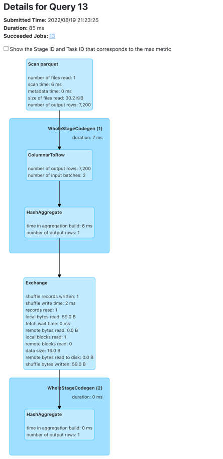
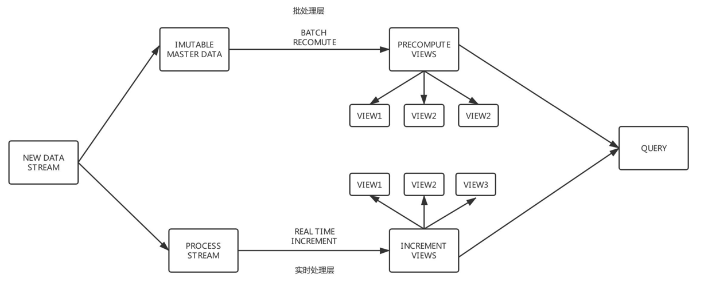
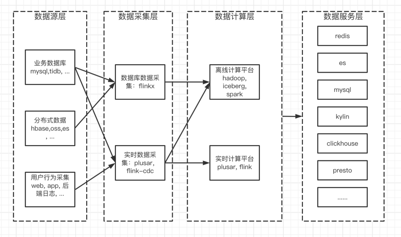

# 毕业设计

## 题目一: 分析一条 TPCDS SQL
分析一条 TPCDS SQL（请基于 Spark 3.1.1 版本解答）

运行该 SQL，如 q38，并截图该 SQL 的 SQL 执行图
该 SQL 用到了哪些优化规则（optimizer rules）
请各用不少于 200 字描述其中的两条优化规则
SQL 从中任意选择一条：
https://github.com/apache/spark/tree/master/sql/core/src/test/resources/tpcds

1. 执行步骤
```
    1. 从 github 下载 TPCDS 数据生成器
    git clone https://github.com/maropu/spark-tpcds-datagen.git
    cd spark-tpcds-datagen

    2. 下载 Spark3.1.1 到 spark-tpcds-datagen 目录并解压
    wget https://archive.apache.org/dist/spark/spark-3.1.1/spark-3.1.1-bin-hadoop2.7.tgz
    tar -zxvf spark-3.1.1-bin-hadoop2.7.tgz

    3. 生成数据
    mkdir -p tpcds-data-1g
    export SPARK_HOME=./spark-3.1.1-bin-hadoop2.7
    ./bin/dsdgen --output-location tpcds-data-1g

    4. 下载三个 test jar 并放到当前目录
    wget https://repo1.maven.org/maven2/org/apache/spark/spark-catalyst_2.12/3.1.1/spark-catalyst_2.12-3.1.1-tests.jar
    wget https://repo1.maven.org/maven2/org/apache/spark/spark-core_2.12/3.1.1/spark-core_2.12-3.1.1-tests.jar
    wget https://repo1.maven.org/maven2/org/apache/spark/spark-sql_2.12/3.1.1/spark-sql_2.12-3.1.1-tests.jar

    5. 执行 SQL
    ./spark-3.1.1-bin-hadoop2.7/bin/spark-submit --conf spark.sql.planChangeLog.level=WARN \
     --class org.apache.spark.sql.execution.benchmark.TPCDSQueryBenchmark \
     --jars spark-core_2.12-3.1.1-tests.jar,spark-catalyst_2.12-3.1.1-tests.jar spark-sql_2.12-3.1.1-tests.jar \
     --data-location tpcds-data-1g --query-filter "q73" > bench73.log 2>&1
```
2. sql 执行图
sql运行太快，只截到一张图

3. 该 SQL 用到了哪些优化规则（optimizer rules）
以下是从执行的log文件中截取的日志文件
```
22/08/19 21:58:25 WARN PlanChangeLogger:
=== Applying Rule org.apache.spark.sql.catalyst.optimizer.ColumnPruning ===
 Aggregate [count(1) AS count#37L]                                                                                                                                                            Aggregate [count(1) AS count#37L]
!+- Relation[cp_catalog_page_sk#0,cp_catalog_page_id#1,cp_start_date_sk#2,cp_end_date_sk#3,cp_department#4,cp_catalog_number#5,cp_catalog_page_number#6,cp_description#7,cp_type#8] parquet   +- Project
!                                                                                                                                                                                                +- Relation[cp_catalog_page_sk#0,cp_catalog_page_id#1,cp_start_date_sk#2,cp_end_date_sk#3,cp_department#4,cp_catalog_number#5,cp_catalog_page_number#6,cp_description#7,cp_type#8] parquet
……                                                                                                                                                                                                                                                                                          +- Relation[wp_web_page_sk#1759,wp_web_page_id#1760,wp_rec_start_date#1761,wp_rec_end_date#1762,wp_creation_date_sk#1763,wp_access_date_sk#1764,wp_autogen_flag#1765,wp_customer_sk#1766,wp_url#1767,wp_type#1768,wp_char_count#1769,wp_link_count#1770,wp_image_count#1771,wp_max_ad_count#1772] parquet
22/08/19 21:58:31 WARN PlanChangeLogger:
=== Applying Rule org.apache.spark.sql.catalyst.optimizer.ReorderJoin ===
 OverwriteByExpression RelationV2[] noop-table, true, true                                                                                                                                                                                                                                                                                                                                                                                                                                                                                                                                                                            OverwriteByExpression RelationV2[] noop-table, true, true
 +- Sort [cnt#1828L DESC NULLS LAST], true                                                                                                                                                                                                                                                                                                                                                                                                                                                                                                                                                                                            +- Sort [cnt#1828L DESC NULLS LAST], true
    +- Project [c_last_name#163, c_first_name#162, c_salutation#161, c_preferred_cust_flag#164, ss_ticket_number#1163, cnt#1828L]                                                                                                                                                                                                                                                                                                                                                                                                                                                                                                        +- Project [c_last_name#163, c_first_name#162, c_salutation#161, c_preferred_cust_flag#164, ss_ticket_number#1163, cnt#1828L]
       +- Filter ((ss_customer_sk#1157 = c_customer_sk#154) AND ((cnt#1828L >= cast(1 as bigint)) AND (cnt#1828L <= cast(5 as bigint))))                                                                                                                                                                                                                                                                                                                                                                                                                                                                                                    +- Filter ((ss_customer_sk#1157 = c_customer_sk#154) AND ((cnt#1828L >= cast(1 as bigint)) AND (cnt#1828L <= cast(5 as bigint))))
          +- Join Inner                                                                                                                                                                                                                                                                                                                                                                                                                                                                                                                                                                                                                        +- Join Inner
             :- Aggregate [ss_ticket_number#1163, ss_customer_sk#1157], [ss_ticket_number#1163, ss_customer_sk#1157, count(1) AS cnt#1828L]                                                                                                                                                                                                                                                                                                                                                                                                                                                                                                       :- Aggregate [ss_ticket_number#1163, ss_customer_sk#1157], [ss_ticket_number#1163, ss_customer_sk#1157, count(1) AS cnt#1828L]
!            :  +- Filter (((((ss_sold_date_sk#1154 = d_date_sk#329) AND (ss_store_sk#1161 = s_store_sk#666)) AND (ss_hdemo_sk#1159 = hd_demo_sk#446)) AND (((d_dom#338 >= 1) AND (d_dom#338 <= 2)) AND ((hd_buy_potential#448 = >10000) OR (hd_buy_potential#448 = unknown)))) AND (((hd_vehicle_count#450 > 0) AND (CASE WHEN (hd_vehicle_count#450 > 0) THEN (cast(hd_dep_count#449 as double) / cast(hd_vehicle_count#450 as double)) ELSE cast(null as double) END > cast(1 as double))) AND (d_year#335 IN (1999,(1999 + 1),(1999 + 2)) AND s_county#689 IN (Williamson County,Franklin Parish,Bronx County,Orange County))))               :  +- Join Inner, ((((ss_hdemo_sk#1159 = hd_demo_sk#446) AND ((hd_buy_potential#448 = >10000) OR (hd_buy_potential#448 = unknown))) AND (hd_vehicle_count#450 > 0)) AND (CASE WHEN (hd_vehicle_count#450 > 0) THEN (cast(hd_dep_count#449 as double) / cast(hd_vehicle_count#450 as double)) ELSE cast(null as double) END > cast(1 as double)))
!            :     +- Join Inner                                                                                                                                                                                                                                                                                                                                                                                                                                                                                                                                                                                                                  :     :- Join Inner, ((ss_store_sk#1161 = s_store_sk#666) AND s_county#689 IN (Williamson County,Franklin Parish,Bronx County,Orange County))
!            :        :- Join Inner                                                                                                                                                                                                                                                                                                                                                                                                                                                                                                                                                                                                               :     :  :- Join Inner, ((((ss_sold_date_sk#1154 = d_date_sk#329) AND (d_dom#338 >= 1)) AND (d_dom#338 <= 2)) AND d_year#335 IN (1999,(1999 + 1),(1999 + 2)))
!            :        :  :- Join Inner                                                                                                                                                                                                                                                                                                                                                                                                                                                                                                                                                                                                            :     :  :  :- Relation[ss_sold_date_sk#1154,ss_sold_time_sk#1155,ss_item_sk#1156,ss_customer_sk#1157,ss_cdemo_sk#1158,ss_hdemo_sk#1159,ss_addr_sk#1160,ss_store_sk#1161,ss_promo_sk#1162,ss_ticket_number#1163,ss_quantity#1164,ss_wholesale_cost#1165,ss_list_price#1166,ss_sales_price#1167,ss_ext_discount_amt#1168,ss_ext_sales_price#1169,ss_ext_wholesale_cost#1170,ss_ext_list_price#1171,ss_ext_tax#1172,ss_coupon_amt#1173,ss_net_paid#1174,ss_net_paid_inc_tax#1175,ss_net_profit#1176] parquet
!            :        :  :  :- Relation[ss_sold_date_sk#1154,ss_sold_time_sk#1155,ss_item_sk#1156,ss_customer_sk#1157,ss_cdemo_sk#1158,ss_hdemo_sk#1159,ss_addr_sk#1160,ss_store_sk#1161,ss_promo_sk#1162,ss_ticket_number#1163,ss_quantity#1164,ss_wholesale_cost#1165,ss_list_price#1166,ss_sales_price#1167,ss_ext_discount_amt#1168,ss_ext_sales_price#1169,ss_ext_wholesale_cost#1170,ss_ext_list_price#1171,ss_ext_tax#1172,ss_coupon_amt#1173,ss_net_paid#1174,ss_net_paid_inc_tax#1175,ss_net_profit#1176] parquet                                                                                                                        :     :  :  +- Relation[d_date_sk#329,d_date_id#330,d_date#331,d_month_seq#332,d_week_seq#333,d_quarter_seq#334,d_year#335,d_dow#336,d_moy#337,d_dom#338,d_qoy#339,d_fy_year#340,d_fy_quarter_seq#341,d_fy_week_seq#342,d_day_name#343,d_quarter_name#344,d_holiday#345,d_weekend#346,d_following_holiday#347,d_first_dom#348,d_last_dom#349,d_same_day_ly#350,d_same_day_lq#351,d_current_day#352,... 4 more fields] parquet
!            :        :  :  +- Relation[d_date_sk#329,d_date_id#330,d_date#331,d_month_seq#332,d_week_seq#333,d_quarter_seq#334,d_year#335,d_dow#336,d_moy#337,d_dom#338,d_qoy#339,d_fy_year#340,d_fy_quarter_seq#341,d_fy_week_seq#342,d_day_name#343,d_quarter_name#344,d_holiday#345,d_weekend#346,d_following_holiday#347,d_first_dom#348,d_last_dom#349,d_same_day_ly#350,d_same_day_lq#351,d_current_day#352,... 4 more fields] parquet                                                                                                                                                                                                     :     :  +- Relation[s_store_sk#666,s_store_id#667,s_rec_start_date#668,s_rec_end_date#669,s_closed_date_sk#670,s_store_name#671,s_number_employees#672,s_floor_space#673,s_hours#674,s_manager#675,s_market_id#676,s_geography_class#677,s_market_desc#678,s_market_manager#679,s_division_id#680,s_division_name#681,s_company_id#682,s_company_name#683,s_street_number#684,s_street_name#685,s_street_type#686,s_suite_number#687,s_city#688,s_county#689,... 5 more fields] parquet
!            :        :  +- Relation[s_store_sk#666,s_store_id#667,s_rec_start_date#668,s_rec_end_date#669,s_closed_date_sk#670,s_store_name#671,s_number_employees#672,s_floor_space#673,s_hours#674,s_manager#675,s_market_id#676,s_geography_class#677,s_market_desc#678,s_market_manager#679,s_division_id#680,s_division_name#681,s_company_id#682,s_company_name#683,s_street_number#684,s_street_name#685,s_street_type#686,s_suite_number#687,s_city#688,s_county#689,... 5 more fields] parquet                                                                                                                                          :     +- Relation[hd_demo_sk#446,hd_income_band_sk#447,hd_buy_potential#448,hd_dep_count#449,hd_vehicle_count#450] parquet
!            :        +- Relation[hd_demo_sk#446,hd_income_band_sk#447,hd_buy_potential#448,hd_dep_count#449,hd_vehicle_count#450] parquet                                                                                                                                                                                                                                                                                                                                                                                                                                                                                                        +- Relation[c_customer_sk#154,c_customer_id#155,c_current_cdemo_sk#156,c_current_hdemo_sk#157,c_current_addr_sk#158,c_first_shipto_date_sk#159,c_first_sales_date_sk#160,c_salutation#161,c_first_name#162,c_last_name#163,c_preferred_cust_flag#164,c_birth_day#165,c_birth_month#166,c_birth_year#167,c_birth_country#168,c_login#169,c_email_address#170,c_last_review_date#171] parquet
!            +- Relation[c_customer_sk#154,c_customer_id#155,c_current_cdemo_sk#156,c_current_hdemo_sk#157,c_current_addr_sk#158,c_first_shipto_date_sk#159,c_first_sales_date_sk#160,c_salutation#161,c_first_name#162,c_last_name#163,c_preferred_cust_flag#164,c_birth_day#165,c_birth_month#166,c_birth_year#167,c_birth_country#168,c_login#169,c_email_address#170,c_last_review_date#171] parquet
22/08/19 21:58:31 WARN PlanChangeLogger:
=== Applying Rule org.apache.spark.sql.catalyst.optimizer.PushDownPredicates ===
 OverwriteByExpression RelationV2[] noop-table, true, true                                                                                                                                                                                                                                                                                                                                                                                                                                                                OverwriteByExpression RelationV2[] noop-table, true, true
 +- Sort [cnt#1828L DESC NULLS LAST], true                                                                                                                                                                                                                                                                                                                                                                                                                                                                                +- Sort [cnt#1828L DESC NULLS LAST], true
    +- Project [c_last_name#163, c_first_name#162, c_salutation#161, c_preferred_cust_flag#164, ss_ticket_number#1163, cnt#1828L]                                                                                                                                                                                                                                                                                                                                                                                            +- Project [c_last_name#163, c_first_name#162, c_salutation#161, c_preferred_cust_flag#164, ss_ticket_number#1163, cnt#1828L]
!      +- Filter ((ss_customer_sk#1157 = c_customer_sk#154) AND ((cnt#1828L >= cast(1 as bigint)) AND (cnt#1828L <= cast(5 as bigint))))                                                                                                                                                                                                                                                                                                                                                                                        +- Join Inner, (ss_customer_sk#1157 = c_customer_sk#154)
!         +- Join Inner                                                                                                                                                                                                                                                                                                                                                                                                                                                                                                            :- Filter ((cnt#1828L >= cast(1 as bigint)) AND (cnt#1828L <= cast(5 as bigint)))
!            :- Aggregate [ss_ticket_number#1163, ss_customer_sk#1157], [ss_ticket_number#1163, ss_customer_sk#1157, count(1) AS cnt#1828L]                                                                                                                                                                                                                                                                                                                                                                                        :  +- Aggregate [ss_ticket_number#1163, ss_customer_sk#1157], [ss_ticket_number#1163, ss_customer_sk#1157, count(1) AS cnt#1828L]
!            :  +- Join Inner, ((((ss_hdemo_sk#1159 = hd_demo_sk#446) AND ((hd_buy_potential#448 = >10000) OR (hd_buy_potential#448 = unknown))) AND (hd_vehicle_count#450 > 0)) AND (CASE WHEN (hd_vehicle_count#450 > 0) THEN (cast(hd_dep_count#449 as double) / cast(hd_vehicle_count#450 as double)) ELSE cast(null as double) END > cast(1 as double)))                                                                                                                                                                      :     +- Join Inner, (ss_hdemo_sk#1159 = hd_demo_sk#446)
!            :     :- Join Inner, ((ss_store_sk#1161 = s_store_sk#666) AND s_county#689 IN (Williamson County,Franklin Parish,Bronx County,Orange County))                                                                                                                                                                                                                                                                                                                                                                         :        :- Join Inner, (ss_store_sk#1161 = s_store_sk#666)
!            :     :  :- Join Inner, ((((ss_sold_date_sk#1154 = d_date_sk#329) AND (d_dom#338 >= 1)) AND (d_dom#338 <= 2)) AND d_year#335 IN (1999,(1999 + 1),(1999 + 2)))                                                                                                                                                                                                                                                                                                                                                         :        :  :- Join Inner, (ss_sold_date_sk#1154 = d_date_sk#329)
!            :     :  :  :- Relation[ss_sold_date_sk#1154,ss_sold_time_sk#1155,ss_item_sk#1156,ss_customer_sk#1157,ss_cdemo_sk#1158,ss_hdemo_sk#1159,ss_addr_sk#1160,ss_store_sk#1161,ss_promo_sk#1162,ss_ticket_number#1163,ss_quantity#1164,ss_wholesale_cost#1165,ss_list_price#1166,ss_sales_price#1167,ss_ext_discount_amt#1168,ss_ext_sales_price#1169,ss_ext_wholesale_cost#1170,ss_ext_list_price#1171,ss_ext_tax#1172,ss_coupon_amt#1173,ss_net_paid#1174,ss_net_paid_inc_tax#1175,ss_net_profit#1176] parquet            :        :  :  :- Relation[ss_sold_date_sk#1154,ss_sold_time_sk#1155,ss_item_sk#1156,ss_customer_sk#1157,ss_cdemo_sk#1158,ss_hdemo_sk#1159,ss_addr_sk#1160,ss_store_sk#1161,ss_promo_sk#1162,ss_ticket_number#1163,ss_quantity#1164,ss_wholesale_cost#1165,ss_list_price#1166,ss_sales_price#1167,ss_ext_discount_amt#1168,ss_ext_sales_price#1169,ss_ext_wholesale_cost#1170,ss_ext_list_price#1171,ss_ext_tax#1172,ss_coupon_amt#1173,ss_net_paid#1174,ss_net_paid_inc_tax#1175,ss_net_profit#1176] parquet
!            :     :  :  +- Relation[d_date_sk#329,d_date_id#330,d_date#331,d_month_seq#332,d_week_seq#333,d_quarter_seq#334,d_year#335,d_dow#336,d_moy#337,d_dom#338,d_qoy#339,d_fy_year#340,d_fy_quarter_seq#341,d_fy_week_seq#342,d_day_name#343,d_quarter_name#344,d_holiday#345,d_weekend#346,d_following_holiday#347,d_first_dom#348,d_last_dom#349,d_same_day_ly#350,d_same_day_lq#351,d_current_day#352,... 4 more fields] parquet                                                                                         :        :  :  +- Filter (((d_dom#338 >= 1) AND (d_dom#338 <= 2)) AND d_year#335 IN (1999,(1999 + 1),(1999 + 2)))
!            :     :  +- Relation[s_store_sk#666,s_store_id#667,s_rec_start_date#668,s_rec_end_date#669,s_closed_date_sk#670,s_store_name#671,s_number_employees#672,s_floor_space#673,s_hours#674,s_manager#675,s_market_id#676,s_geography_class#677,s_market_desc#678,s_market_manager#679,s_division_id#680,s_division_name#681,s_company_id#682,s_company_name#683,s_street_number#684,s_street_name#685,s_street_type#686,s_suite_number#687,s_city#688,s_county#689,... 5 more fields] parquet                              :        :  :     +- Relation[d_date_sk#329,d_date_id#330,d_date#331,d_month_seq#332,d_week_seq#333,d_quarter_seq#334,d_year#335,d_dow#336,d_moy#337,d_dom#338,d_qoy#339,d_fy_year#340,d_fy_quarter_seq#341,d_fy_week_seq#342,d_day_name#343,d_quarter_name#344,d_holiday#345,d_weekend#346,d_following_holiday#347,d_first_dom#348,d_last_dom#349,d_same_day_ly#350,d_same_day_lq#351,d_current_day#352,... 4 more fields] parquet
!            :     +- Relation[hd_demo_sk#446,hd_income_band_sk#447,hd_buy_potential#448,hd_dep_count#449,hd_vehicle_count#450] parquet                                                                                                                                                                                                                                                                              :        :  +- Filter s_county#689 IN (Williamson County,Franklin Parish,Bronx County,Orange County)
!            +- Relation[c_customer_sk#154,c_customer_id#155,c_current_cdemo_sk#156,c_current_hdemo_sk#157,c_current_addr_sk#158,c_first_shipto_date_sk#159,c_first_sales_date_sk#160,c_salutation#161,c_first_name#162,c_last_name#163,c_preferred_cust_flag#164,c_birth_day#165,c_birth_month#166,c_birth_year#167,c_birth_country#168,c_login#169,c_email_address#170,c_last_review_date#171] parquet                                                                                                                           :        :     +- Relation[s_store_sk#666,s_store_id#667,s_rec_start_date#668,s_rec_end_date#669,s_closed_date_sk#670,s_store_name#671,s_number_employees#672,s_floor_space#673,s_hours#674,s_manager#675,s_market_id#676,s_geography_class#677,s_market_desc#678,s_market_manager#679,s_division_id#680,s_division_name#681,s_company_id#682,s_company_name#683,s_street_number#684,s_street_name#685,s_street_type#686,s_suite_number#687,s_city#688,s_county#689,... 5 more fields] parquet
!                                                                                                                                                                                                                                                                                                                                                                                                                                                                                                                                  :        +- Filter ((((hd_buy_potential#448 = >10000) OR (hd_buy_potential#448 = unknown)) AND (hd_vehicle_count#450 > 0)) AND (CASE WHEN (hd_vehicle_count#450 > 0) THEN (cast(hd_dep_count#449 as double) / cast(hd_vehicle_count#450 as double)) ELSE cast(null as double) END > cast(1 as double)))
!                                                                                                                                                                                                                                                                                                                                                                                                                                                                                                                                  :           +- Relation[hd_demo_sk#446,hd_income_band_sk#447,hd_buy_potential#448,hd_dep_count#449,hd_vehicle_count#450] parquet
!                                                                                                                                                                                                                                                                                                                                                                                                                                                                                                                                  +- Relation[c_customer_sk#154,c_customer_id#155,c_current_cdemo_sk#156,c_current_hdemo_sk#157,c_current_addr_sk#158,c_first_shipto_date_sk#159,c_first_sales_date_sk#160,c_salutation#161,c_first_name#162,c_last_name#163,c_preferred_cust_flag#164,c_birth_day#165,c_birth_month#166,c_birth_year#167,c_birth_country#168,c_login#169,c_email_address#170,c_last_review_date#171] parquet
22/08/19 21:58:31 WARN PlanChangeLogger:
=== Applying Rule org.apache.spark.sql.catalyst.optimizer.ColumnPruning ===
 OverwriteByExpression RelationV2[] noop-table, true, true                                                                                                                                                                                                                                                                                                                                                                                                                                                                OverwriteByExpression RelationV2[] noop-table, true, true
 +- Sort [cnt#1828L DESC NULLS LAST], true                                                                                                                                                                                                                                                                                                                                                                                                                                                                                +- Sort [cnt#1828L DESC NULLS LAST], true
    +- Project [c_last_name#163, c_first_name#162, c_salutation#161, c_preferred_cust_flag#164, ss_ticket_number#1163, cnt#1828L]                                                                                                                                                                                                                                                                                                                                                                                            +- Project [c_last_name#163, c_first_name#162, c_salutation#161, c_preferred_cust_flag#164, ss_ticket_number#1163, cnt#1828L]
       +- Join Inner, (ss_customer_sk#1157 = c_customer_sk#154)                                                                                                                                                                                                                                                                                                                                                                                                                                                                 +- Join Inner, (ss_customer_sk#1157 = c_customer_sk#154)
          :- Filter ((cnt#1828L >= cast(1 as bigint)) AND (cnt#1828L <= cast(5 as bigint)))                                                                                                                                                                                                                                                                                                                                                                                                                                        :- Filter ((cnt#1828L >= cast(1 as bigint)) AND (cnt#1828L <= cast(5 as bigint)))
          :  +- Aggregate [ss_ticket_number#1163, ss_customer_sk#1157], [ss_ticket_number#1163, ss_customer_sk#1157, count(1) AS cnt#1828L]                                                                                                                                                                                                                                                                                                                                                                                        :  +- Aggregate [ss_ticket_number#1163, ss_customer_sk#1157], [ss_ticket_number#1163, ss_customer_sk#1157, count(1) AS cnt#1828L]
!         :     +- Join Inner, (ss_hdemo_sk#1159 = hd_demo_sk#446)                                                                                                                                                                                                                                                                                                                                                                                                                                                                 :     +- Project [ss_customer_sk#1157, ss_ticket_number#1163]
!         :        :- Join Inner, (ss_store_sk#1161 = s_store_sk#666)                                                                                                                                                                                                                                                                                                                                                                                                                                                              :        +- Join Inner, (ss_hdemo_sk#1159 = hd_demo_sk#446)
!         :        :  :- Join Inner, (ss_sold_date_sk#1154 = d_date_sk#329)                                                                                                                                                                                                                                                                                                                                                                                                                                                        :           :- Project [ss_customer_sk#1157, ss_hdemo_sk#1159, ss_ticket_number#1163]
!         :        :  :  :- Relation[ss_sold_date_sk#1154,ss_sold_time_sk#1155,ss_item_sk#1156,ss_customer_sk#1157,ss_cdemo_sk#1158,ss_hdemo_sk#1159,ss_addr_sk#1160,ss_store_sk#1161,ss_promo_sk#1162,ss_ticket_number#1163,ss_quantity#1164,ss_wholesale_cost#1165,ss_list_price#1166,ss_sales_price#1167,ss_ext_discount_amt#1168,ss_ext_sales_price#1169,ss_ext_wholesale_cost#1170,ss_ext_list_price#1171,ss_ext_tax#1172,ss_coupon_amt#1173,ss_net_paid#1174,ss_net_paid_inc_tax#1175,ss_net_profit#1176] parquet            :           :  +- Join Inner, (ss_store_sk#1161 = s_store_sk#666)
!         :        :  :  +- Filter (((d_dom#338 >= 1) AND (d_dom#338 <= 2)) AND d_year#335 IN (1999,(1999 + 1),(1999 + 2)))                                                                                                                                                                                                                                                                                                                                                                                                        :           :     :- Project [ss_customer_sk#1157, ss_hdemo_sk#1159, ss_store_sk#1161, ss_ticket_number#1163]
!         :        :  :     +- Relation[d_date_sk#329,d_date_id#330,d_date#331,d_month_seq#332,d_week_seq#333,d_quarter_seq#334,d_year#335,d_dow#336,d_moy#337,d_dom#338,d_qoy#339,d_fy_year#340,d_fy_quarter_seq#341,d_fy_week_seq#342,d_day_name#343,d_quarter_name#344,d_holiday#345,d_weekend#346,d_following_holiday#347,d_first_dom#348,d_last_dom#349,d_same_day_ly#350,d_same_day_lq#351,d_current_day#352,... 4 more fields] parquet                                                                                      :           :     :  +- Join Inner, (ss_sold_date_sk#1154 = d_date_sk#329)
!         :        :  +- Filter s_county#689 IN (Williamson County,Franklin Parish,Bronx County,Orange County)                                                                                                                                                                                                                                                                                                                                                                                                                     :           :     :     :- Project [ss_sold_date_sk#1154, ss_customer_sk#1157, ss_hdemo_sk#1159, ss_store_sk#1161, ss_ticket_number#1163]
!         :        :     +- Relation[s_store_sk#666,s_store_id#667,s_rec_start_date#668,s_rec_end_date#669,s_closed_date_sk#670,s_store_name#671,s_number_employees#672,s_floor_space#673,s_hours#674,s_manager#675,s_market_id#676,s_geography_class#677,s_market_desc#678,s_market_manager#679,s_division_id#680,s_division_name#681,s_company_id#682,s_company_name#683,s_street_number#684,s_street_name#685,s_street_type#686,s_suite_number#687,s_city#688,s_county#689,... 5 more fields] parquet                           :           :     :     :  +- Relation[ss_sold_date_sk#1154,ss_sold_time_sk#1155,ss_item_sk#1156,ss_customer_sk#1157,ss_cdemo_sk#1158,ss_hdemo_sk#1159,ss_addr_sk#1160,ss_store_sk#1161,ss_promo_sk#1162,ss_ticket_number#1163,ss_quantity#1164,ss_wholesale_cost#1165,ss_list_price#1166,ss_sales_price#1167,ss_ext_discount_amt#1168,ss_ext_sales_price#1169,ss_ext_wholesale_cost#1170,ss_ext_list_price#1171,ss_ext_tax#1172,ss_coupon_amt#1173,ss_net_paid#1174,ss_net_paid_inc_tax#1175,ss_net_profit#1176] parquet
!         :        +- Filter ((((hd_buy_potential#448 = >10000) OR (hd_buy_potential#448 = unknown)) AND (hd_vehicle_count#450 > 0)) AND (CASE WHEN (hd_vehicle_count#450 > 0) THEN (cast(hd_dep_count#449 as double) / cast(hd_vehicle_count#450 as double)) ELSE cast(null as double) END > cast(1 as double)))                                                                                                                                                                                                                  :           :     :     +- Project [d_date_sk#329]
!         :           +- Relation[hd_demo_sk#446,hd_income_band_sk#447,hd_buy_potential#448,hd_dep_count#449,hd_vehicle_count#450] parquet                                                                                                                                                                                                                                                                                                                                                                                         :           :     :        +- Filter (((d_dom#338 >= 1) AND (d_dom#338 <= 2)) AND d_year#335 IN (1999,(1999 + 1),(1999 + 2)))
!         +- Relation[c_customer_sk#154,c_customer_id#155,c_current_cdemo_sk#156,c_current_hdemo_sk#157,c_current_addr_sk#158,c_first_shipto_date_sk#159,c_first_sales_date_sk#160,c_salutation#161,c_first_name#162,c_last_name#163,c_preferred_cust_flag#164,c_birth_day#165,c_birth_month#166,c_birth_year#167,c_birth_country#168,c_login#169,c_email_address#170,c_last_review_date#171] parquet                                                                                                                              :           :     :           +- Relation[d_date_sk#329,d_date_id#330,d_date#331,d_month_seq#332,d_week_seq#333,d_quarter_seq#334,d_year#335,d_dow#336,d_moy#337,d_dom#338,d_qoy#339,d_fy_year#340,d_fy_quarter_seq#341,d_fy_week_seq#342,d_day_name#343,d_quarter_name#344,d_holiday#345,d_weekend#346,d_following_holiday#347,d_first_dom#348,d_last_dom#349,d_same_day_ly#350,d_same_day_lq#351,d_current_day#352,... 4 more fields] parquet
!                                                                                                                                                                                                                                                                                                                                                                                                                                                                                                                                  :           :     +- Project [s_store_sk#666]
!                                                                                                                                                                                                                                                                                                                                                                                                                                                                                                                                  :           :        +- Filter s_county#689 IN (Williamson County,Franklin Parish,Bronx County,Orange County)
!                                                                                                                                                                                                                                                                                                                                                                                                                                                                                                                                  :           :           +- Relation[s_store_sk#666,s_store_id#667,s_rec_start_date#668,s_rec_end_date#669,s_closed_date_sk#670,s_store_name#671,s_number_employees#672,s_floor_space#673,s_hours#674,s_manager#675,s_market_id#676,s_geography_class#677,s_market_desc#678,s_market_manager#679,s_division_id#680,s_division_name#681,s_company_id#682,s_company_name#683,s_street_number#684,s_street_name#685,s_street_type#686,s_suite_number#687,s_city#688,s_county#689,... 5 more fields] parquet
!                                                                                                                                                                                                                                                                                                                                                                                                                                                                                                                                  :           +- Project [hd_demo_sk#446]
!                                                                                                                                                                                                                                                                                                                                                                                                                                                                                                                                  :              +- Filter ((((hd_buy_potential#448 = >10000) OR (hd_buy_potential#448 = unknown)) AND (hd_vehicle_count#450 > 0)) AND (CASE WHEN (hd_vehicle_count#450 > 0) THEN (cast(hd_dep_count#449 as double) / cast(hd_vehicle_count#450 as double)) ELSE cast(null as double) END > cast(1 as double)))
!                                                                                                                                                                                                                                                                                                                                                                                                                                                                                                                                  :                 +- Relation[hd_demo_sk#446,hd_income_band_sk#447,hd_buy_potential#448,hd_dep_count#449,hd_vehicle_count#450] parquet
!                                                                                                                                                                                                                                                                                                                                                                                                                                                                                                                                  +- Project [c_customer_sk#154, c_salutation#161, c_first_name#162, c_last_name#163, c_preferred_cust_flag#164]
!                                                                                                                                                                                                                                                                                                                                                                                                                                                                                                                                     +- Relation[c_customer_sk#154,c_customer_id#155,c_current_cdemo_sk#156,c_current_hdemo_sk#157,c_current_addr_sk#158,c_first_shipto_date_sk#159,c_first_sales_date_sk#160,c_salutation#161,c_first_name#162,c_last_name#163,c_preferred_cust_flag#164,c_birth_day#165,c_birth_month#166,c_birth_year#167,c_birth_country#168,c_login#169,c_email_address#170,c_last_review_date#171] parquet
22/08/19 21:58:31 WARN PlanChangeLogger:
=== Applying Rule org.apache.spark.sql.catalyst.optimizer.NullPropagation ===
 OverwriteByExpression RelationV2[] noop-table, true, true                                                                                                                                                                                                                                                                                                                                                                                                                                                                            OverwriteByExpression RelationV2[] noop-table, true, true
 +- Sort [cnt#1828L DESC NULLS LAST], true                                                                                                                                                                                                                                                                                                                                                                                                                                                                                            +- Sort [cnt#1828L DESC NULLS LAST], true
    +- Project [c_last_name#163, c_first_name#162, c_salutation#161, c_preferred_cust_flag#164, ss_ticket_number#1163, cnt#1828L]                                                                                                                                                                                                                                                                                                                                                                                                        +- Project [c_last_name#163, c_first_name#162, c_salutation#161, c_preferred_cust_flag#164, ss_ticket_number#1163, cnt#1828L]
       +- Join Inner, (ss_customer_sk#1157 = c_customer_sk#154)                                                                                                                                                                                                                                                                                                                                                                                                                                                                             +- Join Inner, (ss_customer_sk#1157 = c_customer_sk#154)
          :- Filter ((cnt#1828L >= cast(1 as bigint)) AND (cnt#1828L <= cast(5 as bigint)))                                                                                                                                                                                                                                                                                                                                                                                                                                                    :- Filter ((cnt#1828L >= cast(1 as bigint)) AND (cnt#1828L <= cast(5 as bigint)))
          :  +- Aggregate [ss_ticket_number#1163, ss_customer_sk#1157], [ss_ticket_number#1163, ss_customer_sk#1157, count(1) AS cnt#1828L]                                                                                                                                                                                                                                                                                                                                                                                                    :  +- Aggregate [ss_ticket_number#1163, ss_customer_sk#1157], [ss_ticket_number#1163, ss_customer_sk#1157, count(1) AS cnt#1828L]
          :     +- Project [ss_customer_sk#1157, ss_ticket_number#1163]                                                                                                                                                                                                                                                                                                                                                                                                                                                                        :     +- Project [ss_customer_sk#1157, ss_ticket_number#1163]
          :        +- Join Inner, (ss_hdemo_sk#1159 = hd_demo_sk#446)                                                                                                                                                                                                                                                                                                                                                                                                                                                                          :        +- Join Inner, (ss_hdemo_sk#1159 = hd_demo_sk#446)
          :           :- Project [ss_customer_sk#1157, ss_hdemo_sk#1159, ss_ticket_number#1163]                                                                                                                                                                                                                                                                                                                                                                                                                                                :           :- Project [ss_customer_sk#1157, ss_hdemo_sk#1159, ss_ticket_number#1163]
          :           :  +- Join Inner, (ss_store_sk#1161 = s_store_sk#666)                                                                                                                                                                                                                                                                                                                                                                                                                                                                    :           :  +- Join Inner, (ss_store_sk#1161 = s_store_sk#666)
          :           :     :- Project [ss_customer_sk#1157, ss_hdemo_sk#1159, ss_store_sk#1161, ss_ticket_number#1163]                                                                                                                                                                                                                                                                                                                                                                                                                        :           :     :- Project [ss_customer_sk#1157, ss_hdemo_sk#1159, ss_store_sk#1161, ss_ticket_number#1163]
          :           :     :  +- Join Inner, (ss_sold_date_sk#1154 = d_date_sk#329)                                                                                                                                                                                                                                                                                                                                                                                                                                                           :           :     :  +- Join Inner, (ss_sold_date_sk#1154 = d_date_sk#329)
          :           :     :     :- Project [ss_sold_date_sk#1154, ss_customer_sk#1157, ss_hdemo_sk#1159, ss_store_sk#1161, ss_ticket_number#1163]                                                                                                                                                                                                                                                                                                                                                                                            :           :     :     :- Project [ss_sold_date_sk#1154, ss_customer_sk#1157, ss_hdemo_sk#1159, ss_store_sk#1161, ss_ticket_number#1163]
          :           :     :     :  +- Relation[ss_sold_date_sk#1154,ss_sold_time_sk#1155,ss_item_sk#1156,ss_customer_sk#1157,ss_cdemo_sk#1158,ss_hdemo_sk#1159,ss_addr_sk#1160,ss_store_sk#1161,ss_promo_sk#1162,ss_ticket_number#1163,ss_quantity#1164,ss_wholesale_cost#1165,ss_list_price#1166,ss_sales_price#1167,ss_ext_discount_amt#1168,ss_ext_sales_price#1169,ss_ext_wholesale_cost#1170,ss_ext_list_price#1171,ss_ext_tax#1172,ss_coupon_amt#1173,ss_net_paid#1174,ss_net_paid_inc_tax#1175,ss_net_profit#1176] parquet            :           :     :     :  +- Relation[ss_sold_date_sk#1154,ss_sold_time_sk#1155,ss_item_sk#1156,ss_customer_sk#1157,ss_cdemo_sk#1158,ss_hdemo_sk#1159,ss_addr_sk#1160,ss_store_sk#1161,ss_promo_sk#1162,ss_ticket_number#1163,ss_quantity#1164,ss_wholesale_cost#1165,ss_list_price#1166,ss_sales_price#1167,ss_ext_discount_amt#1168,ss_ext_sales_price#1169,ss_ext_wholesale_cost#1170,ss_ext_list_price#1171,ss_ext_tax#1172,ss_coupon_amt#1173,ss_net_paid#1174,ss_net_paid_inc_tax#1175,ss_net_profit#1176] parquet
          :           :     :     +- Project [d_date_sk#329]                                                                                                                                                                                                                                                                                                                                                                                                                                                                                   :           :     :     +- Project [d_date_sk#329]
          :           :     :        +- Filter (((d_dom#338 >= 1) AND (d_dom#338 <= 2)) AND d_year#335 IN (1999,(1999 + 1),(1999 + 2)))                                                                                                                                                                                                                                                                                                                                                                                                        :           :     :        +- Filter (((d_dom#338 >= 1) AND (d_dom#338 <= 2)) AND d_year#335 IN (1999,(1999 + 1),(1999 + 2)))
          :           :     :           +- Relation[d_date_sk#329,d_date_id#330,d_date#331,d_month_seq#332,d_week_seq#333,d_quarter_seq#334,d_year#335,d_dow#336,d_moy#337,d_dom#338,d_qoy#339,d_fy_year#340,d_fy_quarter_seq#341,d_fy_week_seq#342,d_day_name#343,d_quarter_name#344,d_holiday#345,d_weekend#346,d_following_holiday#347,d_first_dom#348,d_last_dom#349,d_same_day_ly#350,d_same_day_lq#351,d_current_day#352,... 4 more fields] parquet                                                                                      :           :     :           +- Relation[d_date_sk#329,d_date_id#330,d_date#331,d_month_seq#332,d_week_seq#333,d_quarter_seq#334,d_year#335,d_dow#336,d_moy#337,d_dom#338,d_qoy#339,d_fy_year#340,d_fy_quarter_seq#341,d_fy_week_seq#342,d_day_name#343,d_quarter_name#344,d_holiday#345,d_weekend#346,d_following_holiday#347,d_first_dom#348,d_last_dom#349,d_same_day_ly#350,d_same_day_lq#351,d_current_day#352,... 4 more fields] parquet
          :           :     +- Project [s_store_sk#666]                                                                                                                                                                                                                                                                                                                                                                                                                                                                                        :           :     +- Project [s_store_sk#666]
          :           :        +- Filter s_county#689 IN (Williamson County,Franklin Parish,Bronx County,Orange County)                                                                                                                                                                                                                                                                                                                                                                                                                        :           :        +- Filter s_county#689 IN (Williamson County,Franklin Parish,Bronx County,Orange County)
          :           :           +- Relation[s_store_sk#666,s_store_id#667,s_rec_start_date#668,s_rec_end_date#669,s_closed_date_sk#670,s_store_name#671,s_number_employees#672,s_floor_space#673,s_hours#674,s_manager#675,s_market_id#676,s_geography_class#677,s_market_desc#678,s_market_manager#679,s_division_id#680,s_division_name#681,s_company_id#682,s_company_name#683,s_street_number#684,s_street_name#685,s_street_type#686,s_suite_number#687,s_city#688,s_county#689,... 5 more fields] parquet                              :           :           +- Relation[s_store_sk#666,s_store_id#667,s_rec_start_date#668,s_rec_end_date#669,s_closed_date_sk#670,s_store_name#671,s_number_employees#672,s_floor_space#673,s_hours#674,s_manager#675,s_market_id#676,s_geography_class#677,s_market_desc#678,s_market_manager#679,s_division_id#680,s_division_name#681,s_company_id#682,s_company_name#683,s_street_number#684,s_street_name#685,s_street_type#686,s_suite_number#687,s_city#688,s_county#689,... 5 more fields] parquet
          :           +- Project [hd_demo_sk#446]                                                                                                                                                                                                                                                                                                                                                                                                                                                                                              :           +- Project [hd_demo_sk#446]
!         :              +- Filter ((((hd_buy_potential#448 = >10000) OR (hd_buy_potential#448 = unknown)) AND (hd_vehicle_count#450 > 0)) AND (CASE WHEN (hd_vehicle_count#450 > 0) THEN (cast(hd_dep_count#449 as double) / cast(hd_vehicle_count#450 as double)) ELSE cast(null as double) END > cast(1 as double)))                                                                                                                                                                                                                        :              +- Filter ((((hd_buy_potential#448 = >10000) OR (hd_buy_potential#448 = unknown)) AND (hd_vehicle_count#450 > 0)) AND (CASE WHEN (hd_vehicle_count#450 > 0) THEN (cast(hd_dep_count#449 as double) / cast(hd_vehicle_count#450 as double)) ELSE null END > cast(1 as double)))
          :                 +- Relation[hd_demo_sk#446,hd_income_band_sk#447,hd_buy_potential#448,hd_dep_count#449,hd_vehicle_count#450] parquet                                                                                                                                                                                                                                                                                                                                                                                               :                 +- Relation[hd_demo_sk#446,hd_income_band_sk#447,hd_buy_potential#448,hd_dep_count#449,hd_vehicle_count#450] parquet
          +- Project [c_customer_sk#154, c_salutation#161, c_first_name#162, c_last_name#163, c_preferred_cust_flag#164]                                                                                                                                                                                                                                                                                                                                                                                                                       +- Project [c_customer_sk#154, c_salutation#161, c_first_name#162, c_last_name#163, c_preferred_cust_flag#164]
             +- Relation[c_customer_sk#154,c_customer_id#155,c_current_cdemo_sk#156,c_current_hdemo_sk#157,c_current_addr_sk#158,c_first_shipto_date_sk#159,c_first_sales_date_sk#160,c_salutation#161,c_first_name#162,c_last_name#163,c_preferred_cust_flag#164,c_birth_day#165,c_birth_month#166,c_birth_year#167,c_birth_country#168,c_login#169,c_email_address#170,c_last_review_date#171] parquet                                                                                                                                          +- Relation[c_customer_sk#154,c_customer_id#155,c_current_cdemo_sk#156,c_current_hdemo_sk#157,c_current_addr_sk#158,c_first_shipto_date_sk#159,c_first_sales_date_sk#160,c_salutation#161,c_first_name#162,c_last_name#163,c_preferred_cust_flag#164,c_birth_day#165,c_birth_month#166,c_birth_year#167,c_birth_country#168,c_login#169,c_email_address#170,c_last_review_date#171] parquet
22/08/19 21:58:31 WARN PlanChangeLogger:
=== Applying Rule org.apache.spark.sql.catalyst.optimizer.ConstantFolding ===
 OverwriteByExpression RelationV2[] noop-table, true, true                                                                                                                                                                                                                                                                                                                                                                                                                                                                            OverwriteByExpression RelationV2[] noop-table, true, true
 +- Sort [cnt#1828L DESC NULLS LAST], true                                                                                                                                                                                                                                                                                                                                                                                                                                                                                            +- Sort [cnt#1828L DESC NULLS LAST], true
    +- Project [c_last_name#163, c_first_name#162, c_salutation#161, c_preferred_cust_flag#164, ss_ticket_number#1163, cnt#1828L]                                                                                                                                                                                                                                                                                                                                                                                                        +- Project [c_last_name#163, c_first_name#162, c_salutation#161, c_preferred_cust_flag#164, ss_ticket_number#1163, cnt#1828L]
       +- Join Inner, (ss_customer_sk#1157 = c_customer_sk#154)                                                                                                                                                                                                                                                                                                                                                                                                                                                                             +- Join Inner, (ss_customer_sk#1157 = c_customer_sk#154)
!         :- Filter ((cnt#1828L >= cast(1 as bigint)) AND (cnt#1828L <= cast(5 as bigint)))                                                                                                                                                                                                                                                                                                                                                                                                                                                    :- Filter ((cnt#1828L >= 1) AND (cnt#1828L <= 5))
          :  +- Aggregate [ss_ticket_number#1163, ss_customer_sk#1157], [ss_ticket_number#1163, ss_customer_sk#1157, count(1) AS cnt#1828L]                                                                                                                                                                                                                                                                                                                                                                                                    :  +- Aggregate [ss_ticket_number#1163, ss_customer_sk#1157], [ss_ticket_number#1163, ss_customer_sk#1157, count(1) AS cnt#1828L]
          :     +- Project [ss_customer_sk#1157, ss_ticket_number#1163]                                                                                                                                                                                                                                                                                                                                                                                                                                                                        :     +- Project [ss_customer_sk#1157, ss_ticket_number#1163]
          :        +- Join Inner, (ss_hdemo_sk#1159 = hd_demo_sk#446)                                                                                                                                                                                                                                                                                                                                                                                                                                                                          :        +- Join Inner, (ss_hdemo_sk#1159 = hd_demo_sk#446)
          :           :- Project [ss_customer_sk#1157, ss_hdemo_sk#1159, ss_ticket_number#1163]                                                                                                                                                                                                                                                                                                                                                                                                                                                :           :- Project [ss_customer_sk#1157, ss_hdemo_sk#1159, ss_ticket_number#1163]
          :           :  +- Join Inner, (ss_store_sk#1161 = s_store_sk#666)                                                                                                                                                                                                                                                                                                                                                                                                                                                                    :           :  +- Join Inner, (ss_store_sk#1161 = s_store_sk#666)
          :           :     :- Project [ss_customer_sk#1157, ss_hdemo_sk#1159, ss_store_sk#1161, ss_ticket_number#1163]                                                                                                                                                                                                                                                                                                                                                                                                                        :           :     :- Project [ss_customer_sk#1157, ss_hdemo_sk#1159, ss_store_sk#1161, ss_ticket_number#1163]
          :           :     :  +- Join Inner, (ss_sold_date_sk#1154 = d_date_sk#329)                                                                                                                                                                                                                                                                                                                                                                                                                                                           :           :     :  +- Join Inner, (ss_sold_date_sk#1154 = d_date_sk#329)
          :           :     :     :- Project [ss_sold_date_sk#1154, ss_customer_sk#1157, ss_hdemo_sk#1159, ss_store_sk#1161, ss_ticket_number#1163]                                                                                                                                                                                                                                                                                                                                                                                            :           :     :     :- Project [ss_sold_date_sk#1154, ss_customer_sk#1157, ss_hdemo_sk#1159, ss_store_sk#1161, ss_ticket_number#1163]
          :           :     :     :  +- Relation[ss_sold_date_sk#1154,ss_sold_time_sk#1155,ss_item_sk#1156,ss_customer_sk#1157,ss_cdemo_sk#1158,ss_hdemo_sk#1159,ss_addr_sk#1160,ss_store_sk#1161,ss_promo_sk#1162,ss_ticket_number#1163,ss_quantity#1164,ss_wholesale_cost#1165,ss_list_price#1166,ss_sales_price#1167,ss_ext_discount_amt#1168,ss_ext_sales_price#1169,ss_ext_wholesale_cost#1170,ss_ext_list_price#1171,ss_ext_tax#1172,ss_coupon_amt#1173,ss_net_paid#1174,ss_net_paid_inc_tax#1175,ss_net_profit#1176] parquet            :           :     :     :  +- Relation[ss_sold_date_sk#1154,ss_sold_time_sk#1155,ss_item_sk#1156,ss_customer_sk#1157,ss_cdemo_sk#1158,ss_hdemo_sk#1159,ss_addr_sk#1160,ss_store_sk#1161,ss_promo_sk#1162,ss_ticket_number#1163,ss_quantity#1164,ss_wholesale_cost#1165,ss_list_price#1166,ss_sales_price#1167,ss_ext_discount_amt#1168,ss_ext_sales_price#1169,ss_ext_wholesale_cost#1170,ss_ext_list_price#1171,ss_ext_tax#1172,ss_coupon_amt#1173,ss_net_paid#1174,ss_net_paid_inc_tax#1175,ss_net_profit#1176] parquet
                :           :     :     +- Project [d_date_sk#329]                                                                                                                                                                                                                                                                                                                                                                                                                                                                                   :           :     :     +- Project [d_date_sk#329]
!         :           :     :        +- Filter (((d_dom#338 >= 1) AND (d_dom#338 <= 2)) AND d_year#335 IN (1999,(1999 + 1),(1999 + 2)))                                                                                                                                                                                                                                                                                                                                                                                                        :           :     :        +- Filter (((d_dom#338 >= 1) AND (d_dom#338 <= 2)) AND d_year#335 IN (1999,2000,2001))
          :           :     :           +- Relation[d_date_sk#329,d_date_id#330,d_date#331,d_month_seq#332,d_week_seq#333,d_quarter_seq#334,d_year#335,d_dow#336,d_moy#337,d_dom#338,d_qoy#339,d_fy_year#340,d_fy_quarter_seq#341,d_fy_week_seq#342,d_day_name#343,d_quarter_name#344,d_holiday#345,d_weekend#346,d_following_holiday#347,d_first_dom#348,d_last_dom#349,d_same_day_ly#350,d_same_day_lq#351,d_current_day#352,... 4 more fields] parquet                                                                                      :           :     :           +- Relation[d_date_sk#329,d_date_id#330,d_date#331,d_month_seq#332,d_week_seq#333,d_quarter_seq#334,d_year#335,d_dow#336,d_moy#337,d_dom#338,d_qoy#339,d_fy_year#340,d_fy_quarter_seq#341,d_fy_week_seq#342,d_day_name#343,d_quarter_name#344,d_holiday#345,d_weekend#346,d_following_holiday#347,d_first_dom#348,d_last_dom#349,d_same_day_ly#350,d_same_day_lq#351,d_current_day#352,... 4 more fields] parquet
          :           :     +- Project [s_store_sk#666]                                                                                                                                                                                                                                                                                                                                                                                                                                                                                        :           :     +- Project [s_store_sk#666]
          :           :        +- Filter s_county#689 IN (Williamson County,Franklin Parish,Bronx County,Orange County)                                                                                                                                                                                                                                                                                                                                                                                                                        :           :        +- Filter s_county#689 IN (Williamson County,Franklin Parish,Bronx County,Orange County)
          :           :           +- Relation[s_store_sk#666,s_store_id#667,s_rec_start_date#668,s_rec_end_date#669,s_closed_date_sk#670,s_store_name#671,s_number_employees#672,s_floor_space#673,s_hours#674,s_manager#675,s_market_id#676,s_geography_class#677,s_market_desc#678,s_market_manager#679,s_division_id#680,s_division_name#681,s_company_id#682,s_company_name#683,s_street_number#684,s_street_name#685,s_street_type#686,s_suite_number#687,s_city#688,s_county#689,... 5 more fields] parquet                              :           :           +- Relation[s_store_sk#666,s_store_id#667,s_rec_start_date#668,s_rec_end_date#669,s_closed_date_sk#670,s_store_name#671,s_number_employees#672,s_floor_space#673,s_hours#674,s_manager#675,s_market_id#676,s_geography_class#677,s_market_desc#678,s_market_manager#679,s_division_id#680,s_division_name#681,s_company_id#682,s_company_name#683,s_street_number#684,s_street_name#685,s_street_type#686,s_suite_number#687,s_city#688,s_county#689,... 5 more fields] parquet
          :           +- Project [hd_demo_sk#446]                                                                                                                                                                                                                                                                                                                                                                                                                                                                                              :           +- Project [hd_demo_sk#446]
!         :              +- Filter ((((hd_buy_potential#448 = >10000) OR (hd_buy_potential#448 = unknown)) AND (hd_vehicle_count#450 > 0)) AND (CASE WHEN (hd_vehicle_count#450 > 0) THEN (cast(hd_dep_count#449 as double) / cast(hd_vehicle_count#450 as double)) ELSE null END > cast(1 as double)))                                                                                                                                                                                                                                        :              +- Filter ((((hd_buy_potential#448 = >10000) OR (hd_buy_potential#448 = unknown)) AND (hd_vehicle_count#450 > 0)) AND (CASE WHEN (hd_vehicle_count#450 > 0) THEN (cast(hd_dep_count#449 as double) / cast(hd_vehicle_count#450 as double)) ELSE null END > 1.0))
          :                 +- Relation[hd_demo_sk#446,hd_income_band_sk#447,hd_buy_potential#448,hd_dep_count#449,hd_vehicle_count#450] parquet                                                                                                                                                                                                                                                                                                                                                                                               :                 +- Relation[hd_demo_sk#446,hd_income_band_sk#447,hd_buy_potential#448,hd_dep_count#449,hd_vehicle_count#450] parquet
          +- Project [c_customer_sk#154, c_salutation#161, c_first_name#162, c_last_name#163, c_preferred_cust_flag#164]                                                                                                                                                                                                                                                                                                                                                                                                                       +- Project [c_customer_sk#154, c_salutation#161, c_first_name#162, c_last_name#163, c_preferred_cust_flag#164]
             +- Relation[c_customer_sk#154,c_customer_id#155,c_current_cdemo_sk#156,c_current_hdemo_sk#157,c_current_addr_sk#158,c_first_shipto_date_sk#159,c_first_sales_date_sk#160,c_salutation#161,c_first_name#162,c_last_name#163,c_preferred_cust_flag#164,c_birth_day#165,c_birth_month#166,c_birth_year#167,c_birth_country#168,c_login#169,c_email_address#170,c_last_review_date#171] parquet                                                                                                                                          +- Relation[c_customer_sk#154,c_customer_id#155,c_current_cdemo_sk#156,c_current_hdemo_sk#157,c_current_addr_sk#158,c_first_shipto_date_sk#159,c_first_sales_date_sk#160,c_salutation#161,c_first_name#162,c_last_name#163,c_preferred_cust_flag#164,c_birth_day#165,c_birth_month#166,c_birth_year#167,c_birth_country#168,c_login#169,c_email_address#170,c_last_review_date#171] parquet
22/08/19 21:58:31 WARN PlanChangeLogger:
=== Applying Rule org.apache.spark.sql.catalyst.optimizer.InferFiltersFromConstraints ===
 OverwriteByExpression RelationV2[] noop-table, true, true                                                                                                                                                                                                                                                                                                                                                                                                                                                                            OverwriteByExpression RelationV2[] noop-table, true, true
 +- Sort [cnt#1828L DESC NULLS LAST], true                                                                                                                                                                                                                                                                                                                                                                                                                                                                                            +- Sort [cnt#1828L DESC NULLS LAST], true
    +- Project [c_last_name#163, c_first_name#162, c_salutation#161, c_preferred_cust_flag#164, ss_ticket_number#1163, cnt#1828L]                                                                                                                                                                                                                                                                                                                                                                                                        +- Project [c_last_name#163, c_first_name#162, c_salutation#161, c_preferred_cust_flag#164, ss_ticket_number#1163, cnt#1828L]
       +- Join Inner, (ss_customer_sk#1157 = c_customer_sk#154)                                                                                                                                                                                                                                                                                                                                                                                                                                                                             +- Join Inner, (ss_customer_sk#1157 = c_customer_sk#154)
!         :- Filter ((cnt#1828L >= 1) AND (cnt#1828L <= 5))                                                                                                                                                                                                                                                                                                                                                                                                                                                                                    :- Filter isnotnull(ss_customer_sk#1157)
!         :  +- Aggregate [ss_ticket_number#1163, ss_customer_sk#1157], [ss_ticket_number#1163, ss_customer_sk#1157, count(1) AS cnt#1828L]                                                                                                                                                                                                                                                                                                                                                                                                    :  +- Filter ((cnt#1828L >= 1) AND (cnt#1828L <= 5))
!         :     +- Project [ss_customer_sk#1157, ss_ticket_number#1163]                                                                                                                                                                                                                                                                                                                                                                                                                                                                        :     +- Aggregate [ss_ticket_number#1163, ss_customer_sk#1157], [ss_ticket_number#1163, ss_customer_sk#1157, count(1) AS cnt#1828L]
!         :        +- Join Inner, (ss_hdemo_sk#1159 = hd_demo_sk#446)                                                                                                                                                                                                                                                                                                                                                                                                                                                                          :        +- Project [ss_customer_sk#1157, ss_ticket_number#1163]
!         :           :- Project [ss_customer_sk#1157, ss_hdemo_sk#1159, ss_ticket_number#1163]                                                                                                                                                                                                                                                                                                                                                                                                                                                :           +- Join Inner, (ss_hdemo_sk#1159 = hd_demo_sk#446)
!         :           :  +- Join Inner, (ss_store_sk#1161 = s_store_sk#666)                                                                                                                                                                                                                                                                                                                                                                                                                                                                    :              :- Filter isnotnull(ss_hdemo_sk#1159)
!         :           :     :- Project [ss_customer_sk#1157, ss_hdemo_sk#1159, ss_store_sk#1161, ss_ticket_number#1163]                                                                                                                                                                                                                                                                                                                                                                                                                        :              :  +- Project [ss_customer_sk#1157, ss_hdemo_sk#1159, ss_ticket_number#1163]
!         :           :     :  +- Join Inner, (ss_sold_date_sk#1154 = d_date_sk#329)                                                                                                                                                                                                                                                                                                                                                                                                                                                           :              :     +- Join Inner, (ss_store_sk#1161 = s_store_sk#666)
!         :           :     :     :- Project [ss_sold_date_sk#1154, ss_customer_sk#1157, ss_hdemo_sk#1159, ss_store_sk#1161, ss_ticket_number#1163]                                                                                                                                                                                                                                                                                                                                                                                            :              :        :- Filter isnotnull(ss_store_sk#1161)
!         :           :     :     :  +- Relation[ss_sold_date_sk#1154,ss_sold_time_sk#1155,ss_item_sk#1156,ss_customer_sk#1157,ss_cdemo_sk#1158,ss_hdemo_sk#1159,ss_addr_sk#1160,ss_store_sk#1161,ss_promo_sk#1162,ss_ticket_number#1163,ss_quantity#1164,ss_wholesale_cost#1165,ss_list_price#1166,ss_sales_price#1167,ss_ext_discount_amt#1168,ss_ext_sales_price#1169,ss_ext_wholesale_cost#1170,ss_ext_list_price#1171,ss_ext_tax#1172,ss_coupon_amt#1173,ss_net_paid#1174,ss_net_paid_inc_tax#1175,ss_net_profit#1176] parquet            :              :        :  +- Project [ss_customer_sk#1157, ss_hdemo_sk#1159, ss_store_sk#1161, ss_ticket_number#1163]
!         :           :     :     +- Project [d_date_sk#329]                                                                                                                                                                                                                                                                                                                                                                                                                                                                                   :              :        :     +- Join Inner, (ss_sold_date_sk#1154 = d_date_sk#329)
!         :           :     :        +- Filter (((d_dom#338 >= 1) AND (d_dom#338 <= 2)) AND d_year#335 IN (1999,2000,2001))                                                                                                                                                                                                                                                                                                                                                                                                                    :              :        :        :- Filter isnotnull(ss_sold_date_sk#1154)
!         :           :     :           +- Relation[d_date_sk#329,d_date_id#330,d_date#331,d_month_seq#332,d_week_seq#333,d_quarter_seq#334,d_year#335,d_dow#336,d_moy#337,d_dom#338,d_qoy#339,d_fy_year#340,d_fy_quarter_seq#341,d_fy_week_seq#342,d_day_name#343,d_quarter_name#344,d_holiday#345,d_weekend#346,d_following_holiday#347,d_first_dom#348,d_last_dom#349,d_same_day_ly#350,d_same_day_lq#351,d_current_day#352,... 4 more fields] parquet                                                                                      :              :        :        :  +- Project [ss_sold_date_sk#1154, ss_customer_sk#1157, ss_hdemo_sk#1159, ss_store_sk#1161, ss_ticket_number#1163]
!         :           :     +- Project [s_store_sk#666]                                                                                                                                                                                                                                                                                                                                                                                                                                                                                        :              :        :        :     +- Relation[ss_sold_date_sk#1154,ss_sold_time_sk#1155,ss_item_sk#1156,ss_customer_sk#1157,ss_cdemo_sk#1158,ss_hdemo_sk#1159,ss_addr_sk#1160,ss_store_sk#1161,ss_promo_sk#1162,ss_ticket_number#1163,ss_quantity#1164,ss_wholesale_cost#1165,ss_list_price#1166,ss_sales_price#1167,ss_ext_discount_amt#1168,ss_ext_sales_price#1169,ss_ext_wholesale_cost#1170,ss_ext_list_price#1171,ss_ext_tax#1172,ss_coupon_amt#1173,ss_net_paid#1174,ss_net_paid_inc_tax#1175,ss_net_profit#1176] parquet
!         :           :        +- Filter s_county#689 IN (Williamson County,Franklin Parish,Bronx County,Orange County)                                                                                                                                                                                                                                                                                                                                                                                                                        :              :        :        +- Filter isnotnull(d_date_sk#329)
!         :           :           +- Relation[s_store_sk#666,s_store_id#667,s_rec_start_date#668,s_rec_end_date#669,s_closed_date_sk#670,s_store_name#671,s_number_employees#672,s_floor_space#673,s_hours#674,s_manager#675,s_market_id#676,s_geography_class#677,s_market_desc#678,s_market_manager#679,s_division_id#680,s_division_name#681,s_company_id#682,s_company_name#683,s_street_number#684,s_street_name#685,s_street_type#686,s_suite_number#687,s_city#688,s_county#689,... 5 more fields] parquet                              :              :        :           +- Project [d_date_sk#329]
!         :           +- Project [hd_demo_sk#446]                                                                                                                                                                                                                                                                                                                                                                                                                                                                                              :              :        :              +- Filter (isnotnull(d_dom#338) AND (((d_dom#338 >= 1) AND (d_dom#338 <= 2)) AND d_year#335 IN (1999,2000,2001)))
!         :              +- Filter ((((hd_buy_potential#448 = >10000) OR (hd_buy_potential#448 = unknown)) AND (hd_vehicle_count#450 > 0)) AND (CASE WHEN (hd_vehicle_count#450 > 0) THEN (cast(hd_dep_count#449 as double) / cast(hd_vehicle_count#450 as double)) ELSE null END > 1.0))                                                                                                                                                                                                                                                      :              :        :                 +- Relation[d_date_sk#329,d_date_id#330,d_date#331,d_month_seq#332,d_week_seq#333,d_quarter_seq#334,d_year#335,d_dow#336,d_moy#337,d_dom#338,d_qoy#339,d_fy_year#340,d_fy_quarter_seq#341,d_fy_week_seq#342,d_day_name#343,d_quarter_name#344,d_holiday#345,d_weekend#346,d_following_holiday#347,d_first_dom#348,d_last_dom#349,d_same_day_ly#350,d_same_day_lq#351,d_current_day#352,... 4 more fields] parquet
!         :                 +- Relation[hd_demo_sk#446,hd_income_band_sk#447,hd_buy_potential#448,hd_dep_count#449,hd_vehicle_count#450] parquet                                                                                                                                                                                                                                                                                                                                                                                               :              :        +- Filter isnotnull(s_store_sk#666)
!         +- Project [c_customer_sk#154, c_salutation#161, c_first_name#162, c_last_name#163, c_preferred_cust_flag#164]                                                                                                                                                                                                                                                                                                                                                                                                                       :              :           +- Project [s_store_sk#666]
!            +- Relation[c_customer_sk#154,c_customer_id#155,c_current_cdemo_sk#156,c_current_hdemo_sk#157,c_current_addr_sk#158,c_first_shipto_date_sk#159,c_first_sales_date_sk#160,c_salutation#161,c_first_name#162,c_last_name#163,c_preferred_cust_flag#164,c_birth_day#165,c_birth_month#166,c_birth_year#167,c_birth_country#168,c_login#169,c_email_address#170,c_last_review_date#171] parquet                                                                                                                                       :              :              +- Filter s_county#689 IN (Williamson County,Franklin Parish,Bronx County,Orange County)
!                                                                                                                                                                                                                                                                                                                                                                                                                                                                                                                                              :              :                 +- Relation[s_store_sk#666,s_store_id#667,s_rec_start_date#668,s_rec_end_date#669,s_closed_date_sk#670,s_store_name#671,s_number_employees#672,s_floor_space#673,s_hours#674,s_manager#675,s_market_id#676,s_geography_class#677,s_market_desc#678,s_market_manager#679,s_division_id#680,s_division_name#681,s_company_id#682,s_company_name#683,s_street_number#684,s_street_name#685,s_street_type#686,s_suite_number#687,s_city#688,s_county#689,... 5 more fields] parquet
!                                                                                                                                                                                                                                                                                                                                                                                                                                                                                                                                              :              +- Filter isnotnull(hd_demo_sk#446)
!                                                                                                                                                                                                                                                                                                                                                                                                                                                                                                                                              :                 +- Project [hd_demo_sk#446]
!                                                                                                                                                                                                                                                                                                                                                                                                                                                                                                                                              :                    +- Filter (isnotnull(hd_vehicle_count#450) AND ((((hd_buy_potential#448 = >10000) OR (hd_buy_potential#448 = unknown)) AND (hd_vehicle_count#450 > 0)) AND (CASE WHEN (hd_vehicle_count#450 > 0) THEN (cast(hd_dep_count#449 as double) / cast(hd_vehicle_count#450 as double)) ELSE null END > 1.0)))
!                                                                                                                                                                                                                                                                                                                                                                                                                                                                                                                                              :                       +- Relation[hd_demo_sk#446,hd_income_band_sk#447,hd_buy_potential#448,hd_dep_count#449,hd_vehicle_count#450] parquet
!                                                                                                                                                                                                                                                                                                                                                                                                                                                                                                                                              +- Filter isnotnull(c_customer_sk#154)
!                                                                                                                                                                                                                                                                                                                                                                                                                                                                                                                                                 +- Project [c_customer_sk#154, c_salutation#161, c_first_name#162, c_last_name#163, c_preferred_cust_flag#164]
!                                                                                                                                                                                                                                                                                                                                                                                                                                                                                                                                                    +- Relation[c_customer_sk#154,c_customer_id#155,c_current_cdemo_sk#156,c_current_hdemo_sk#157,c_current_addr_sk#158,c_first_shipto_date_sk#159,c_first_sales_date_sk#160,c_salutation#161,c_first_name#162,c_last_name#163,c_preferred_cust_flag#164,c_birth_day#165,c_birth_month#166,c_birth_year#167,c_birth_country#168,c_login#169,c_email_address#170,c_last_review_date#171] parquet
……
22/08/19 21:58:31 WARN PlanChangeLogger:
=== Applying Rule org.apache.spark.sql.catalyst.optimizer.PushDownPredicates ===
 OverwriteByExpression RelationV2[] noop-table, true, true                                                                                                                                                                                                                                                                                                                                                                                                                                                                                  OverwriteByExpression RelationV2[] noop-table, true, true
 +- Sort [cnt#1828L DESC NULLS LAST], true                                                                                                                                                                                                                                                                                                                                                                                                                                                                                                  +- Sort [cnt#1828L DESC NULLS LAST], true
    +- Project [c_last_name#163, c_first_name#162, c_salutation#161, c_preferred_cust_flag#164, ss_ticket_number#1163, cnt#1828L]                                                                                                                                                                                                                                                                                                                                                                                                              +- Project [c_last_name#163, c_first_name#162, c_salutation#161, c_preferred_cust_flag#164, ss_ticket_number#1163, cnt#1828L]
       +- Join Inner, (ss_customer_sk#1157 = c_customer_sk#154)                                                                                                                                                                                                                                                                                                                                                                                                                                                                                   +- Join Inner, (ss_customer_sk#1157 = c_customer_sk#154)
          :- Filter ((cnt#1828L >= 1) AND (cnt#1828L <= 5))                                                                                                                                                                                                                                                                                                                                                                                                                                                                                          :- Filter ((cnt#1828L >= 1) AND (cnt#1828L <= 5))
          :  +- Aggregate [ss_ticket_number#1163, ss_customer_sk#1157], [ss_ticket_number#1163, ss_customer_sk#1157, count(1) AS cnt#1828L]                                                                                                                                                                                                                                                                                                                                                                                                          :  +- Aggregate [ss_ticket_number#1163, ss_customer_sk#1157], [ss_ticket_number#1163, ss_customer_sk#1157, count(1) AS cnt#1828L]
          :     +- Project [ss_customer_sk#1157, ss_ticket_number#1163]                                                                                                                                                                                                                                                                                                                                                                                                                                                                              :     +- Project [ss_customer_sk#1157, ss_ticket_number#1163]
          :        +- Join Inner, (ss_hdemo_sk#1159 = hd_demo_sk#446)                                                                                                                                                                                                                                                                                                                                                                                                                                                                                :        +- Join Inner, (ss_hdemo_sk#1159 = hd_demo_sk#446)
          :           :- Project [ss_customer_sk#1157, ss_hdemo_sk#1159, ss_ticket_number#1163]                                                                                                                                                                                                                                                                                                                                                                                                                                                      :           :- Project [ss_customer_sk#1157, ss_hdemo_sk#1159, ss_ticket_number#1163]
          :           :  +- Join Inner, (ss_store_sk#1161 = s_store_sk#666)                                                                                                                                                                                                                                                                                                                                                                                                                                                                          :           :  +- Join Inner, (ss_store_sk#1161 = s_store_sk#666)
!         :           :     :- Filter ((isnotnull(ss_store_sk#1161) AND isnotnull(ss_hdemo_sk#1159)) AND isnotnull(ss_customer_sk#1157))                                                                                                                                                                                                                                                                                                                                                                                                             :           :     :- Project [ss_customer_sk#1157, ss_hdemo_sk#1159, ss_store_sk#1161, ss_ticket_number#1163]
!         :           :     :  +- Project [ss_customer_sk#1157, ss_hdemo_sk#1159, ss_store_sk#1161, ss_ticket_number#1163]                                                                                                                                                                                                                                                                                                                                                                                                                           :           :     :  +- Join Inner, (ss_sold_date_sk#1154 = d_date_sk#329)
!         :           :     :     +- Join Inner, (ss_sold_date_sk#1154 = d_date_sk#329)                                                                                                                                                                                                                                                                                                                                                                                                                                                              :           :     :     :- Project [ss_sold_date_sk#1154, ss_customer_sk#1157, ss_hdemo_sk#1159, ss_store_sk#1161, ss_ticket_number#1163]
!         :           :     :        :- Project [ss_sold_date_sk#1154, ss_customer_sk#1157, ss_hdemo_sk#1159, ss_store_sk#1161, ss_ticket_number#1163]                                                                                                                                                                                                                                                                                                                                                                                               :           :     :     :  +- Filter (isnotnull(ss_sold_date_sk#1154) AND ((isnotnull(ss_store_sk#1161) AND isnotnull(ss_hdemo_sk#1159)) AND isnotnull(ss_customer_sk#1157)))
!         :           :     :        :  +- Filter isnotnull(ss_sold_date_sk#1154)                                                                                                                                                                                                                                                                                                                                                                                                                                                                    :           :     :     :     +- Relation[ss_sold_date_sk#1154,ss_sold_time_sk#1155,ss_item_sk#1156,ss_customer_sk#1157,ss_cdemo_sk#1158,ss_hdemo_sk#1159,ss_addr_sk#1160,ss_store_sk#1161,ss_promo_sk#1162,ss_ticket_number#1163,ss_quantity#1164,ss_wholesale_cost#1165,ss_list_price#1166,ss_sales_price#1167,ss_ext_discount_amt#1168,ss_ext_sales_price#1169,ss_ext_wholesale_cost#1170,ss_ext_list_price#1171,ss_ext_tax#1172,ss_coupon_amt#1173,ss_net_paid#1174,ss_net_paid_inc_tax#1175,ss_net_profit#1176] parquet
!         :           :     :        :     +- Relation[ss_sold_date_sk#1154,ss_sold_time_sk#1155,ss_item_sk#1156,ss_customer_sk#1157,ss_cdemo_sk#1158,ss_hdemo_sk#1159,ss_addr_sk#1160,ss_store_sk#1161,ss_promo_sk#1162,ss_ticket_number#1163,ss_quantity#1164,ss_wholesale_cost#1165,ss_list_price#1166,ss_sales_price#1167,ss_ext_discount_amt#1168,ss_ext_sales_price#1169,ss_ext_wholesale_cost#1170,ss_ext_list_price#1171,ss_ext_tax#1172,ss_coupon_amt#1173,ss_net_paid#1174,ss_net_paid_inc_tax#1175,ss_net_profit#1176] parquet            :           :     :     +- Project [d_date_sk#329]
!         :           :     :        +- Project [d_date_sk#329]                                                                                                                                                                                                                                                                                                                                                                                                                                                                                      :           :     :        +- Filter ((isnotnull(d_dom#338) AND (((d_dom#338 >= 1) AND (d_dom#338 <= 2)) AND d_year#335 IN (1999,2000,2001))) AND isnotnull(d_date_sk#329))
!         :           :     :           +- Filter ((isnotnull(d_dom#338) AND (((d_dom#338 >= 1) AND (d_dom#338 <= 2)) AND d_year#335 IN (1999,2000,2001))) AND isnotnull(d_date_sk#329))                                                                                                                                                                                                                                                                                                                                                             :           :     :           +- Relation[d_date_sk#329,d_date_id#330,d_date#331,d_month_seq#332,d_week_seq#333,d_quarter_seq#334,d_year#335,d_dow#336,d_moy#337,d_dom#338,d_qoy#339,d_fy_year#340,d_fy_quarter_seq#341,d_fy_week_seq#342,d_day_name#343,d_quarter_name#344,d_holiday#345,d_weekend#346,d_following_holiday#347,d_first_dom#348,d_last_dom#349,d_same_day_ly#350,d_same_day_lq#351,d_current_day#352,... 4 more fields] parquet
!         :           :     :              +- Relation[d_date_sk#329,d_date_id#330,d_date#331,d_month_seq#332,d_week_seq#333,d_quarter_seq#334,d_year#335,d_dow#336,d_moy#337,d_dom#338,d_qoy#339,d_fy_year#340,d_fy_quarter_seq#341,d_fy_week_seq#342,d_day_name#343,d_quarter_name#344,d_holiday#345,d_weekend#346,d_following_holiday#347,d_first_dom#348,d_last_dom#349,d_same_day_ly#350,d_same_day_lq#351,d_current_day#352,... 4 more fields] parquet                                                                                         :           :     +- Project [s_store_sk#666]
!         :           :     +- Project [s_store_sk#666]                                                                                                                                                                                                                                                                                                                                                                                                                                                                                              :           :        +- Filter (s_county#689 IN (Williamson County,Franklin Parish,Bronx County,Orange County) AND isnotnull(s_store_sk#666))
!         :           :        +- Filter (s_county#689 IN (Williamson County,Franklin Parish,Bronx County,Orange County) AND isnotnull(s_store_sk#666))                                                                                                                                                                                                                                                                                                                                                                                              :           :           +- Relation[s_store_sk#666,s_store_id#667,s_rec_start_date#668,s_rec_end_date#669,s_closed_date_sk#670,s_store_name#671,s_number_employees#672,s_floor_space#673,s_hours#674,s_manager#675,s_market_id#676,s_geography_class#677,s_market_desc#678,s_market_manager#679,s_division_id#680,s_division_name#681,s_company_id#682,s_company_name#683,s_street_number#684,s_street_name#685,s_street_type#686,s_suite_number#687,s_city#688,s_county#689,... 5 more fields] parquet
!         :           :           +- Relation[s_store_sk#666,s_store_id#667,s_rec_start_date#668,s_rec_end_date#669,s_closed_date_sk#670,s_store_name#671,s_number_employees#672,s_floor_space#673,s_hours#674,s_manager#675,s_market_id#676,s_geography_class#677,s_market_desc#678,s_market_manager#679,s_division_id#680,s_division_name#681,s_company_id#682,s_company_name#683,s_street_number#684,s_street_name#685,s_street_type#686,s_suite_number#687,s_city#688,s_county#689,... 5 more fields] parquet                                    :           +- Project [hd_demo_sk#446]
!         :           +- Project [hd_demo_sk#446]                                                                                                                                                                                                                                                                                                                                                                                                                                                                                                    :              +- Filter ((isnotnull(hd_vehicle_count#450) AND ((((hd_buy_potential#448 = >10000) OR (hd_buy_potential#448 = unknown)) AND (hd_vehicle_count#450 > 0)) AND (CASE WHEN (hd_vehicle_count#450 > 0) THEN (cast(hd_dep_count#449 as double) / cast(hd_vehicle_count#450 as double)) ELSE null END > 1.0))) AND isnotnull(hd_demo_sk#446))
!         :              +- Filter ((isnotnull(hd_vehicle_count#450) AND ((((hd_buy_potential#448 = >10000) OR (hd_buy_potential#448 = unknown)) AND (hd_vehicle_count#450 > 0)) AND (CASE WHEN (hd_vehicle_count#450 > 0) THEN (cast(hd_dep_count#449 as double) / cast(hd_vehicle_count#450 as double)) ELSE null END > 1.0))) AND isnotnull(hd_demo_sk#446))                                                                                                                                                                                      :                 +- Relation[hd_demo_sk#446,hd_income_band_sk#447,hd_buy_potential#448,hd_dep_count#449,hd_vehicle_count#450] parquet
!         :                 +- Relation[hd_demo_sk#446,hd_income_band_sk#447,hd_buy_potential#448,hd_dep_count#449,hd_vehicle_count#450] parquet                                                                                                                                                                                                                                                                                                                                                                                                     +- Project [c_customer_sk#154, c_salutation#161, c_first_name#162, c_last_name#163, c_preferred_cust_flag#164]
!         +- Project [c_customer_sk#154, c_salutation#161, c_first_name#162, c_last_name#163, c_preferred_cust_flag#164]                                                                                                                                                                                                                                                                                                                                                                                                                                +- Filter isnotnull(c_customer_sk#154)
!            +- Filter isnotnull(c_customer_sk#154)                                                                                                                                                                                                                                                                                                                                                                                                                                                                                                        +- Relation[c_customer_sk#154,c_customer_id#155,c_current_cdemo_sk#156,c_current_hdemo_sk#157,c_current_addr_sk#158,c_first_shipto_date_sk#159,c_first_sales_date_sk#160,c_salutation#161,c_first_name#162,c_last_name#163,c_preferred_cust_flag#164,c_birth_day#165,c_birth_month#166,c_birth_year#167,c_birth_country#168,c_login#169,c_email_address#170,c_last_review_date#171] parquet
!               +- Relation[c_customer_sk#154,c_customer_id#155,c_current_cdemo_sk#156,c_current_hdemo_sk#157,c_current_addr_sk#158,c_first_shipto_date_sk#159,c_first_sales_date_sk#160,c_salutation#161,c_first_name#162,c_last_name#163,c_preferred_cust_flag#164,c_birth_day#165,c_birth_month#166,c_birth_year#167,c_birth_country#168,c_login#169,c_email_address#170,c_last_review_date#171] parquet
22/08/19 21:58:31 WARN PlanChangeLogger:
=== Applying Rule org.apache.spark.sql.catalyst.optimizer.RewritePredicateSubquery ===
 OverwriteByExpression RelationV2[] noop-table, true, true                                                                                                                                                                                                                                                                                                                                                                                                                                                                               OverwriteByExpression RelationV2[] noop-table, true, true
 +- Sort [cnt#1828L DESC NULLS LAST], true                                                                                                                                                                                                                                                                                                                                                                                                                                                                                               +- Sort [cnt#1828L DESC NULLS LAST], true
    +- Project [c_last_name#163, c_first_name#162, c_salutation#161, c_preferred_cust_flag#164, ss_ticket_number#1163, cnt#1828L]                                                                                                                                                                                                                                                                                                                                                                                                           +- Project [c_last_name#163, c_first_name#162, c_salutation#161, c_preferred_cust_flag#164, ss_ticket_number#1163, cnt#1828L]
       +- Join Inner, (ss_customer_sk#1157 = c_customer_sk#154)                                                                                                                                                                                                                                                                                                                                                                                                                                                                                +- Join Inner, (ss_customer_sk#1157 = c_customer_sk#154)
          :- Filter ((cnt#1828L >= 1) AND (cnt#1828L <= 5))                                                                                                                                                                                                                                                                                                                                                                                                                                                                                       :- Filter ((cnt#1828L >= 1) AND (cnt#1828L <= 5))
          :  +- Aggregate [ss_ticket_number#1163, ss_customer_sk#1157], [ss_ticket_number#1163, ss_customer_sk#1157, count(1) AS cnt#1828L]                                                                                                                                                                                                                                                                                                                                                                                                       :  +- Aggregate [ss_ticket_number#1163, ss_customer_sk#1157], [ss_ticket_number#1163, ss_customer_sk#1157, count(1) AS cnt#1828L]
          :     +- Project [ss_customer_sk#1157, ss_ticket_number#1163]                                                                                                                                                                                                                                                                                                                                                                                                                                                                           :     +- Project [ss_customer_sk#1157, ss_ticket_number#1163]
          :        +- Join Inner, (ss_hdemo_sk#1159 = hd_demo_sk#446)                                                                                                                                                                                                                                                                                                                                                                                                                                                                             :        +- Join Inner, (ss_hdemo_sk#1159 = hd_demo_sk#446)
          :           :- Project [ss_customer_sk#1157, ss_hdemo_sk#1159, ss_ticket_number#1163]                                                                                                                                                                                                                                                                                                                                                                                                                                                   :           :- Project [ss_customer_sk#1157, ss_hdemo_sk#1159, ss_ticket_number#1163]
          :           :  +- Join Inner, (ss_store_sk#1161 = s_store_sk#666)                                                                                                                                                                                                                                                                                                                                                                                                                                                                       :           :  +- Join Inner, (ss_store_sk#1161 = s_store_sk#666)
          :           :     :- Project [ss_customer_sk#1157, ss_hdemo_sk#1159, ss_store_sk#1161, ss_ticket_number#1163]                                                                                                                                                                                                                                                                                                                                                                                                                           :           :     :- Project [ss_customer_sk#1157, ss_hdemo_sk#1159, ss_store_sk#1161, ss_ticket_number#1163]
          :           :     :  +- Join Inner, (ss_sold_date_sk#1154 = d_date_sk#329)                                                                                                                                                                                                                                                                                                                                                                                                                                                              :           :     :  +- Join Inner, (ss_sold_date_sk#1154 = d_date_sk#329)
          :           :     :     :- Project [ss_sold_date_sk#1154, ss_customer_sk#1157, ss_hdemo_sk#1159, ss_store_sk#1161, ss_ticket_number#1163]                                                                                                                                                                                                                                                                                                                                                                                               :           :     :     :- Project [ss_sold_date_sk#1154, ss_customer_sk#1157, ss_hdemo_sk#1159, ss_store_sk#1161, ss_ticket_number#1163]
!         :           :     :     :  +- Filter (isnotnull(ss_sold_date_sk#1154) AND ((isnotnull(ss_store_sk#1161) AND isnotnull(ss_hdemo_sk#1159)) AND isnotnull(ss_customer_sk#1157)))                                                                                                                                                                                                                                                                                                                                                           :           :     :     :  +- Filter (((isnotnull(ss_sold_date_sk#1154) AND isnotnull(ss_store_sk#1161)) AND isnotnull(ss_hdemo_sk#1159)) AND isnotnull(ss_customer_sk#1157))
          :           :     :     :     +- Relation[ss_sold_date_sk#1154,ss_sold_time_sk#1155,ss_item_sk#1156,ss_customer_sk#1157,ss_cdemo_sk#1158,ss_hdemo_sk#1159,ss_addr_sk#1160,ss_store_sk#1161,ss_promo_sk#1162,ss_ticket_number#1163,ss_quantity#1164,ss_wholesale_cost#1165,ss_list_price#1166,ss_sales_price#1167,ss_ext_discount_amt#1168,ss_ext_sales_price#1169,ss_ext_wholesale_cost#1170,ss_ext_list_price#1171,ss_ext_tax#1172,ss_coupon_amt#1173,ss_net_paid#1174,ss_net_paid_inc_tax#1175,ss_net_profit#1176] parquet            :           :     :     :     +- Relation[ss_sold_date_sk#1154,ss_sold_time_sk#1155,ss_item_sk#1156,ss_customer_sk#1157,ss_cdemo_sk#1158,ss_hdemo_sk#1159,ss_addr_sk#1160,ss_store_sk#1161,ss_promo_sk#1162,ss_ticket_number#1163,ss_quantity#1164,ss_wholesale_cost#1165,ss_list_price#1166,ss_sales_price#1167,ss_ext_discount_amt#1168,ss_ext_sales_price#1169,ss_ext_wholesale_cost#1170,ss_ext_list_price#1171,ss_ext_tax#1172,ss_coupon_amt#1173,ss_net_paid#1174,ss_net_paid_inc_tax#1175,ss_net_profit#1176] parquet
                :           :     :     +- Project [d_date_sk#329]                                                                                                                                                                                                                                                                                                                                                                                                                                                                                      :           :     :     +- Project [d_date_sk#329]
!         :           :     :        +- Filter ((isnotnull(d_dom#338) AND (((d_dom#338 >= 1) AND (d_dom#338 <= 2)) AND d_year#335 IN (1999,2000,2001))) AND isnotnull(d_date_sk#329))                                                                                                                                                                                                                                                                                                                                                             :           :     :        +- Filter ((((isnotnull(d_dom#338) AND (d_dom#338 >= 1)) AND (d_dom#338 <= 2)) AND d_year#335 IN (1999,2000,2001)) AND isnotnull(d_date_sk#329))
          :           :     :           +- Relation[d_date_sk#329,d_date_id#330,d_date#331,d_month_seq#332,d_week_seq#333,d_quarter_seq#334,d_year#335,d_dow#336,d_moy#337,d_dom#338,d_qoy#339,d_fy_year#340,d_fy_quarter_seq#341,d_fy_week_seq#342,d_day_name#343,d_quarter_name#344,d_holiday#345,d_weekend#346,d_following_holiday#347,d_first_dom#348,d_last_dom#349,d_same_day_ly#350,d_same_day_lq#351,d_current_day#352,... 4 more fields] parquet                                                                                         :           :     :           +- Relation[d_date_sk#329,d_date_id#330,d_date#331,d_month_seq#332,d_week_seq#333,d_quarter_seq#334,d_year#335,d_dow#336,d_moy#337,d_dom#338,d_qoy#339,d_fy_year#340,d_fy_quarter_seq#341,d_fy_week_seq#342,d_day_name#343,d_quarter_name#344,d_holiday#345,d_weekend#346,d_following_holiday#347,d_first_dom#348,d_last_dom#349,d_same_day_ly#350,d_same_day_lq#351,d_current_day#352,... 4 more fields] parquet
          :           :     +- Project [s_store_sk#666]                                                                                                                                                                                                                                                                                                                                                                                                                                                                                           :           :     +- Project [s_store_sk#666]
          :           :        +- Filter (s_county#689 IN (Williamson County,Franklin Parish,Bronx County,Orange County) AND isnotnull(s_store_sk#666))                                                                                                                                                                                                                                                                                                                                                                                           :           :        +- Filter (s_county#689 IN (Williamson County,Franklin Parish,Bronx County,Orange County) AND isnotnull(s_store_sk#666))
          :           :           +- Relation[s_store_sk#666,s_store_id#667,s_rec_start_date#668,s_rec_end_date#669,s_closed_date_sk#670,s_store_name#671,s_number_employees#672,s_floor_space#673,s_hours#674,s_manager#675,s_market_id#676,s_geography_class#677,s_market_desc#678,s_market_manager#679,s_division_id#680,s_division_name#681,s_company_id#682,s_company_name#683,s_street_number#684,s_street_name#685,s_street_type#686,s_suite_number#687,s_city#688,s_county#689,... 5 more fields] parquet                                 :           :           +- Relation[s_store_sk#666,s_store_id#667,s_rec_start_date#668,s_rec_end_date#669,s_closed_date_sk#670,s_store_name#671,s_number_employees#672,s_floor_space#673,s_hours#674,s_manager#675,s_market_id#676,s_geography_class#677,s_market_desc#678,s_market_manager#679,s_division_id#680,s_division_name#681,s_company_id#682,s_company_name#683,s_street_number#684,s_street_name#685,s_street_type#686,s_suite_number#687,s_city#688,s_county#689,... 5 more fields] parquet
          :           +- Project [hd_demo_sk#446]                                                                                                                                                                                                                                                                                                                                                                                                                                                                                                 :           +- Project [hd_demo_sk#446]
!         :              +- Filter ((isnotnull(hd_vehicle_count#450) AND ((((hd_buy_potential#448 = >10000) OR (hd_buy_potential#448 = unknown)) AND (hd_vehicle_count#450 > 0)) AND (CASE WHEN (hd_vehicle_count#450 > 0) THEN (cast(hd_dep_count#449 as double) / cast(hd_vehicle_count#450 as double)) ELSE null END > 1.0))) AND isnotnull(hd_demo_sk#446))                                                                                                                                                                                   :              +- Filter ((((isnotnull(hd_vehicle_count#450) AND ((hd_buy_potential#448 = >10000) OR (hd_buy_potential#448 = unknown))) AND (hd_vehicle_count#450 > 0)) AND (CASE WHEN (hd_vehicle_count#450 > 0) THEN (cast(hd_dep_count#449 as double) / cast(hd_vehicle_count#450 as double)) ELSE null END > 1.0)) AND isnotnull(hd_demo_sk#446))
          :                 +- Relation[hd_demo_sk#446,hd_income_band_sk#447,hd_buy_potential#448,hd_dep_count#449,hd_vehicle_count#450] parquet                                                                                                                                                                                                                                                                                                                                                                                                  :                 +- Relation[hd_demo_sk#446,hd_income_band_sk#447,hd_buy_potential#448,hd_dep_count#449,hd_vehicle_count#450] parquet
          +- Project [c_customer_sk#154, c_salutation#161, c_first_name#162, c_last_name#163, c_preferred_cust_flag#164]                                                                                                                                                                                                                                                                                                                                                                                                                          +- Project [c_customer_sk#154, c_salutation#161, c_first_name#162, c_last_name#163, c_preferred_cust_flag#164]
             +- Filter isnotnull(c_customer_sk#154)                                                                                                                                                                                                                                                                                                                                                                                                                                                                                                  +- Filter isnotnull(c_customer_sk#154)
                +- Relation[c_customer_sk#154,c_customer_id#155,c_current_cdemo_sk#156,c_current_hdemo_sk#157,c_current_addr_sk#158,c_first_shipto_date_sk#159,c_first_sales_date_sk#160,c_salutation#161,c_first_name#162,c_last_name#163,c_preferred_cust_flag#164,c_birth_day#165,c_birth_month#166,c_birth_year#167,c_birth_country#168,c_login#169,c_email_address#170,c_last_review_date#171] parquet                                                                                                                                             +- Relation[c_customer_sk#154,c_customer_id#155,c_current_cdemo_sk#156,c_current_hdemo_sk#157,c_current_addr_sk#158,c_first_shipto_date_sk#159,c_first_sales_date_sk#160,c_salutation#161,c_first_name#162,c_last_name#163,c_preferred_cust_flag#164,c_birth_day#165,c_birth_month#166,c_birth_year#167,c_birth_country#168,c_login#169,c_email_address#170,c_last_review_date#171] parquet
……
```
从日志中看出SQL应用了以下规则:
* org.apache.spark.sql.catalyst.optimizer.ColumnPruning
* org.apache.spark.sql.catalyst.optimizer.ReorderJoin
* org.apache.spark.sql.catalyst.optimizer.PushDownPredicates
* org.apache.spark.sql.catalyst.optimizer.NullPropagation
* org.apache.spark.sql.catalyst.optimizer.ConstantFolding
* org.apache.spark.sql.catalyst.optimizer.InferFiltersFromConstraints
* org.apache.spark.sql.catalyst.optimizer.RewritePredicateSubquery

q73
```sql
SELECT
  c_last_name,
  c_first_name,
  c_salutation,
  c_preferred_cust_flag,
  ss_ticket_number,
  cnt
FROM
  (SELECT
    ss_ticket_number,
    ss_customer_sk,
    count(*) cnt
  FROM store_sales, date_dim, store, household_demographics
  WHERE store_sales.ss_sold_date_sk = date_dim.d_date_sk
    AND store_sales.ss_store_sk = store.s_store_sk
    AND store_sales.ss_hdemo_sk = household_demographics.hd_demo_sk
    AND date_dim.d_dom BETWEEN 1 AND 2
    AND (household_demographics.hd_buy_potential = '>10000' OR
    household_demographics.hd_buy_potential = 'unknown')
    AND household_demographics.hd_vehicle_count > 0
    AND CASE WHEN household_demographics.hd_vehicle_count > 0
    THEN
      household_demographics.hd_dep_count / household_demographics.hd_vehicle_count
        ELSE NULL END > 1
    AND date_dim.d_year IN (1999, 1999 + 1, 1999 + 2)
    AND store.s_county IN ('Williamson County', 'Franklin Parish', 'Bronx County', 'Orange County')
  GROUP BY ss_ticket_number, ss_customer_sk) dj, customer
WHERE ss_customer_sk = c_customer_sk
  AND cnt BETWEEN 1 AND 5
ORDER BY cnt DESC
```

### 规则一：ColumnPruning
这条规则在整个日志中出现的次数最多， 下面看一下这条规则在注释中的说明
```java
/**
 * Attempts to eliminate the reading of unneeded columns from the query plan.
 *
 * Since adding Project before Filter conflicts with PushPredicatesThroughProject, this rule will
 * remove the Project p2 in the following pattern:
 *
 *   p1 @ Project(_, Filter(_, p2 @ Project(_, child))) if p2.outputSet.subsetOf(p2.inputSet)
 *
 * p2 is usually inserted by this rule and useless, p1 could prune the columns anyway.
 */
```
这条规则是为了减少读取不需要读取的字段。结合PushDownPredicates, 可以进一步减少读取的字段。在这个sql中， 
store_sales只需要ss_sold_date_sk， ss_store_sk， ss_hdemo_sk， ss_ticket_number， ss_customer_sk 五个字段
date_dim表结合PushDownPredicates后，只需要d_date_sk一个字段
store表结合PushDownPredicates后只需要一个字段s_store_sk字段
household_demographics表结合PushDownPredicates后只需要一个字段hd_demo_sk字段
customer表只需要c_last_name, c_first_name, c_salutation, c_preferred_cust_flag, c_customer_sk五个字段
经过ColumnPruning优化后，可以大量减少文件的读取，加快sql速度。

### 规则二：PushDownPredicates
这条规则主要是把过滤条件下堆到数据读取的时候，以减少读取的数据量，可以减少join时数据量，也可以减少shuffle的数据量。下面看一下这条规则的注释
```java
/**
 * The unified version for predicate pushdown of normal operators and joins.
 * This rule improves performance of predicate pushdown for cascading joins such as:
 *  Filter-Join-Join-Join. Most predicates can be pushed down in a single pass.
 */
```
这条规则联合使用了两个优化规则：PushPredicateThroughNonJoin， PushPredicateThroughJoin
PushPredicateThroughNonJoin， 将结果具有确定性的条件进行下推。
PushPredicateThroughJoin，将只应用于join的left或right的条件进行下推
在本例中主要应用PushPredicateThroughJoin规则，应用于表 date_dim, store, household_demographics这三张表。

## 题目二：架构设计题
  你是某互联网公司的大数据平台架构师，请设计一套基于 Lambda 架构的数据平台架构，要求尽可能多的把课程中涉及的组件添加到该架构图中。并描述 Lambda 架构的优缺点，要求不少于 300 字。
  
Lambda 架构是一种能高效处理海量数据的实时数据处理技术，其高效性来自于大吞吐量，低延迟以及良好的容错性。
根据老师在课上讲的lambda架构图：与网上查到的资料lambda架构分为
三层离线层（Batch Layer），加速层（Speed layer），服务层（Serving layer）。其中的离线层为架构图中的批处理层，
加速层为图中的实时处理层，服务层就是图中的views, 供上层应用进行查询。在这个基础上，我对每一层做了一些技术选型
进行填充形成如下架构图：通过数据采集层，把数据从数据源层采集到大数据平台，
其中离线层的数据存储在haddop,通过iceberg来统一表格式，以便于各计算引擎间的格式兼容；
加速层数据存储在plusar，这里与kafka的一个比较主要原因是plusar的分层架构中将broker与数据存储分离，可以支持理好的扩容；
服务层可先的就比较多，可以根据不同的场景进行选择，但尽量进行统一。

这只是最基本的lambda构架图，还有许多服务没有增加在这一张构架图上，比如老师在课上课的元数据中心，开发中心等。
有许多开源组件可选。可以用hiveMetastore来存储元数据，kyuubi来提供统一的jdbc/odbc服务,
atlas提供数据血缘，griffin来进行数据质量， azkaban进行任务调度等等。

下面讲一下lambda架构的优缺点：

lambda架构的优点有：
* 离线层采用分布式存储管理历史信息，数据不容易损坏
* 加速层解决了数据的实效性问题，离线层解决可靠性，可以实时结果数据进行修正。平衡了速度与可靠性 
* 容灾而兼具弹性的数据处理架构

lambda架构的缺点有：
* 离线层与加速层的逻辑实现分层，相同的业务可能出现逻辑不一致问题。同时的逻辑可能需要开发多套代码
* 重新部署和迁移成本很高